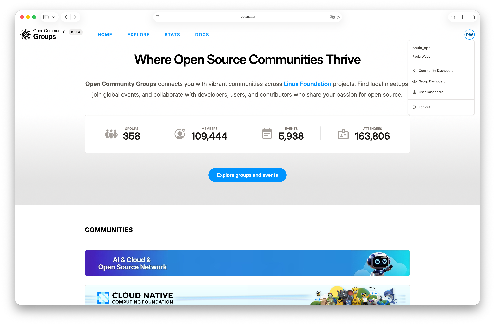
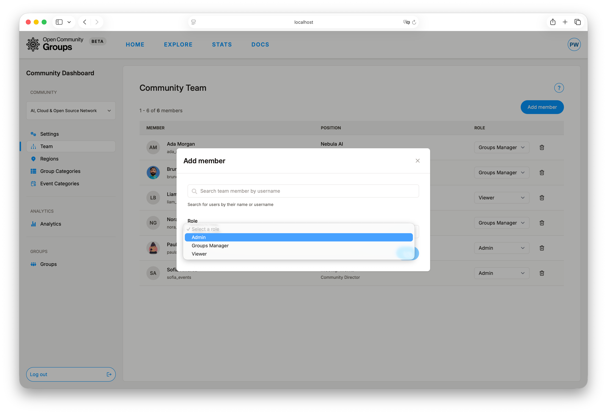
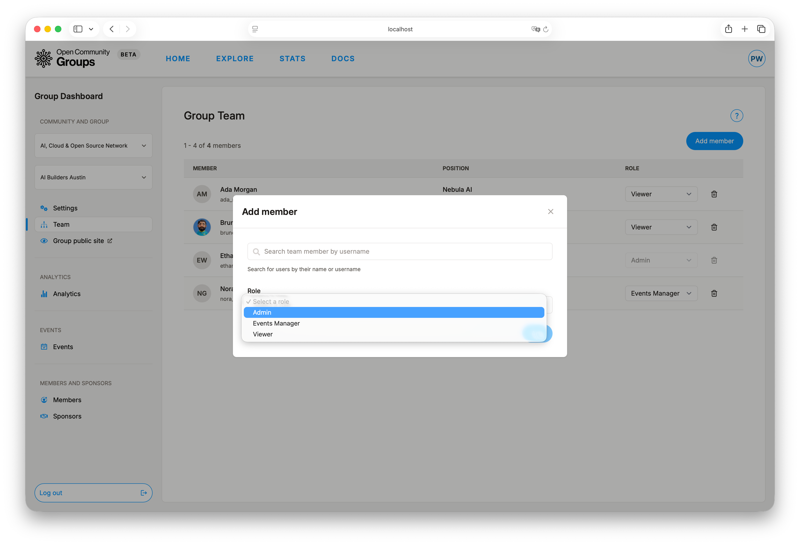

<!-- markdownlint-disable MD013 -->

# Choose Your Dashboard

OCG has three dashboards, each supporting a different kind of work: personal tasks (`User`),
alliance management (`Alliance`), and group or event management (`Group`).

## How to Pick the Right Workspace

Start with what you need to do, not the menu label. This matrix combines tasks, access, and
expected outcomes in one view:

| If you need to... | Use this dashboard | Who gets it | Core outcomes |
| --- | --- | --- | --- |
| Manage your profile, invitations, proposals, submissions, and your own audit history | [User Dashboard](/dashboard/user ':ignore') | Any logged-in user | Keep profile current, accept invitations, submit to CFS, review your actions |
| Manage alliance-wide identity, admins, taxonomy, analytics, groups, and alliance audit logs | [Alliance Dashboard](/dashboard/alliance ':ignore') | Alliance team members | Manage team access, branding, regions, categories, analytics, groups, and review alliance actions |
| Run events, organizers, members, sponsors, and group audit review | [Group Dashboard](/dashboard/group ':ignore') | Group team members | Deliver events, manage members, coordinate organizers and sponsors, and review group actions |

Guide deep-dives:

- [Public Site Guide](../guides/public-site.md)
- [User Dashboard Guide](../guides/user-dashboard.md)
- [Alliance Dashboard Guide](../guides/alliance-dashboard.md)
- [Group Dashboard Guide](../guides/group-dashboard.md)
- [Event Operations](../guides/event-operations.md)

## Access Model and Why It Matters

Dashboard visibility depends on your role. If a dashboard is missing from your menu, your account
does not currently have access to it.

The two organizer dashboards also depend on selected context:

- [Alliance Dashboard](/dashboard/alliance ':ignore') requires a selected alliance.
- [Group Dashboard](/dashboard/group ':ignore') requires both a selected alliance and a selected group.

If the right context is not selected yet, some organizer actions stay unavailable until you choose
the needed alliance or group.

!> Missing dashboard entries usually mean you either do not have access yet or have not selected
the right context.
Alliance Dashboard needs a selected alliance.
Group Dashboard needs both a selected alliance and a selected group.

## Fixed Role Model

OCG now uses fixed roles for alliance and group management. Roles are assigned per team member and
define what operations are allowed.

Alliance team roles:

| Role | What it can do |
| --- | --- |
| `admin` | Full alliance management (`settings`, `taxonomy`, `team`, `groups`) and group-level write operations in that alliance |
| `groups-manager` | Manage groups and group-level write operations in that alliance, without alliance settings/taxonomy/team control |
| `viewer` | Read-only access |

Group team roles:

| Role | What it can do |
| --- | --- |
| `admin` | Full group management (`events`, `members`, `settings`, `sponsors`, `team`) |
| `events-manager` | Event operations only (`events`) |
| `viewer` | Read-only access |

UI behavior:

- Controls are disabled when your role cannot perform an operation.
- Alliances can restrict group team management to alliance `admin` and `groups-manager` roles.
- Server-side authorization still enforces permissions even if a request is sent manually.

## If a Dashboard Is Missing

Use this order to unblock quickly:

1. Open [User Dashboard -> Invitations](/dashboard/user?tab=invitations ':ignore').
2. Accept pending alliance/group invitations.
3. Refresh the page (or sign out/in).
4. Re-open your avatar menu and check for new dashboard entries.

If visibility still does not update, use
[Troubleshooting](../support/troubleshooting.md).

## Typical Starting Paths

### Member or speaker path

Start in [User Dashboard](/dashboard/user ':ignore'), complete your profile, then create session proposals
only when you need to submit to event CFS.

Continue with [User Dashboard Guide](../guides/user-dashboard.md) and
[Public Site Guide](../guides/public-site.md).

### Alliance lead path

Start in [Alliance Dashboard](/dashboard/alliance?tab=settings ':ignore') to verify settings and team
membership first, then review [Regions](/dashboard/alliance?tab=regions ':ignore'),
[Group Categories](/dashboard/alliance?tab=group-categories ':ignore'), and
[Event Categories](/dashboard/alliance?tab=event-categories ':ignore'). Move to
[Groups](/dashboard/alliance?tab=groups ':ignore') after taxonomy and ownership structure are in place.
Use [Logs](/dashboard/alliance?tab=logs ':ignore') when you need a historical view of alliance dashboard activity.

Continue with [Alliance Dashboard Guide](../guides/alliance-dashboard.md).

### Group organizer path

Start in [Group Dashboard](/dashboard/group?tab=settings ':ignore') and move straight into
[Events](/dashboard/group?tab=events ':ignore'), because event setup, publishing, attendance, and
submissions are the operational center of group work. Use
[Logs](/dashboard/group?tab=logs ':ignore') when you need a historical view of group dashboard activity.

Continue with [Group Dashboard Guide](../guides/group-dashboard.md) and
[Event Operations](../guides/event-operations.md).
