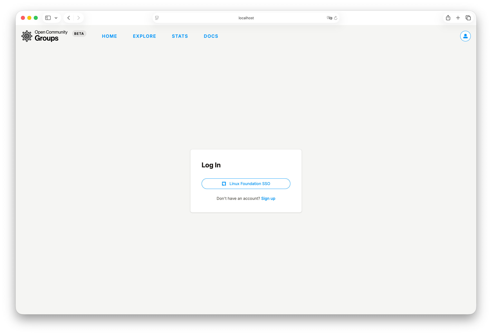
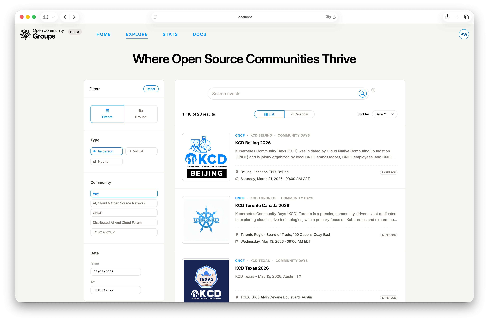
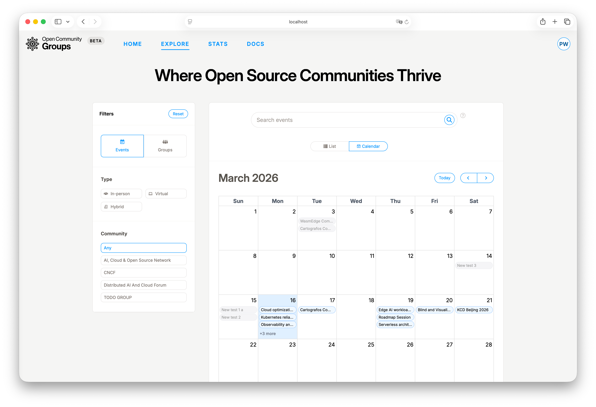
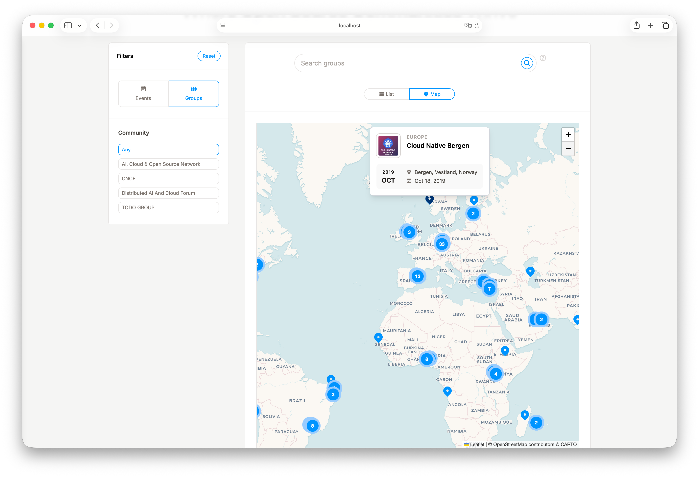
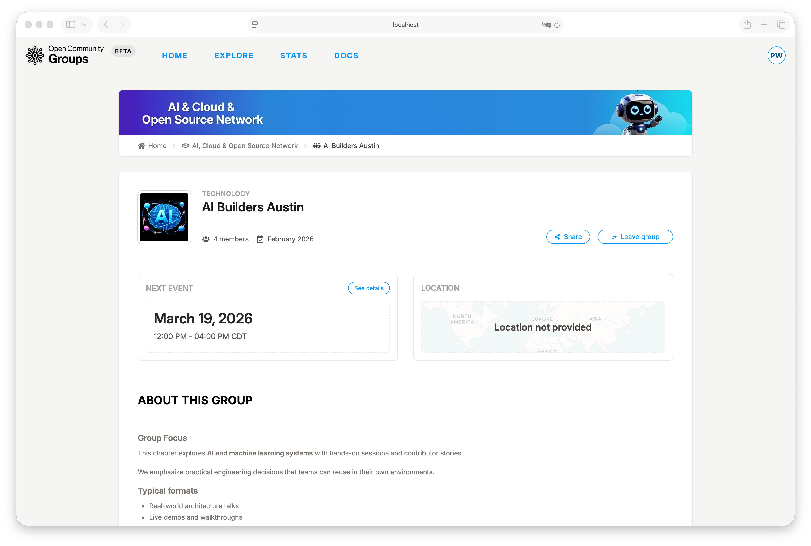
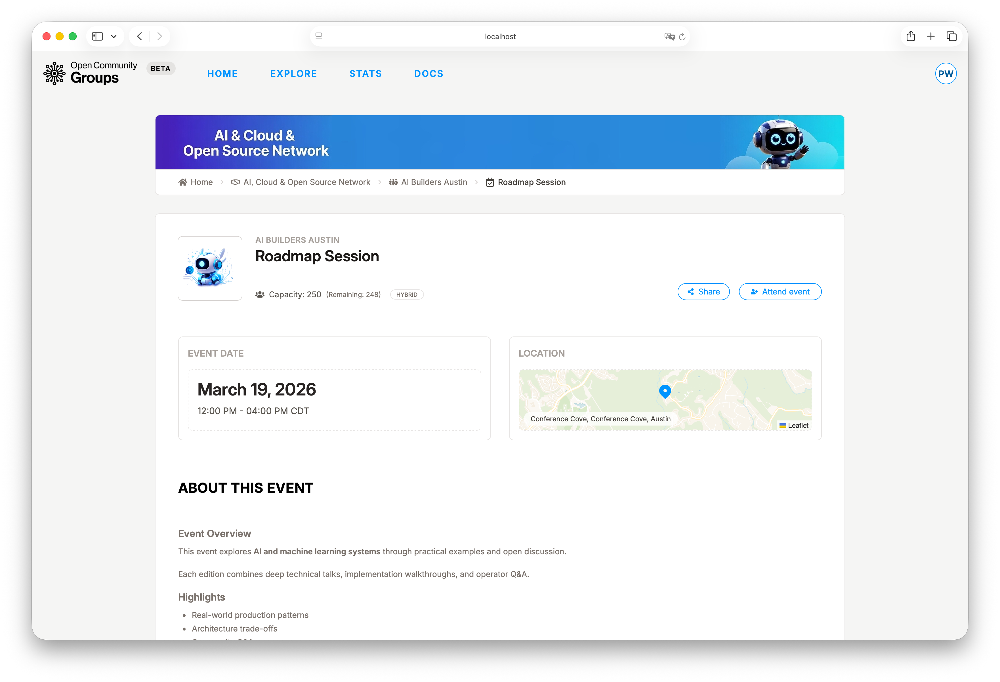
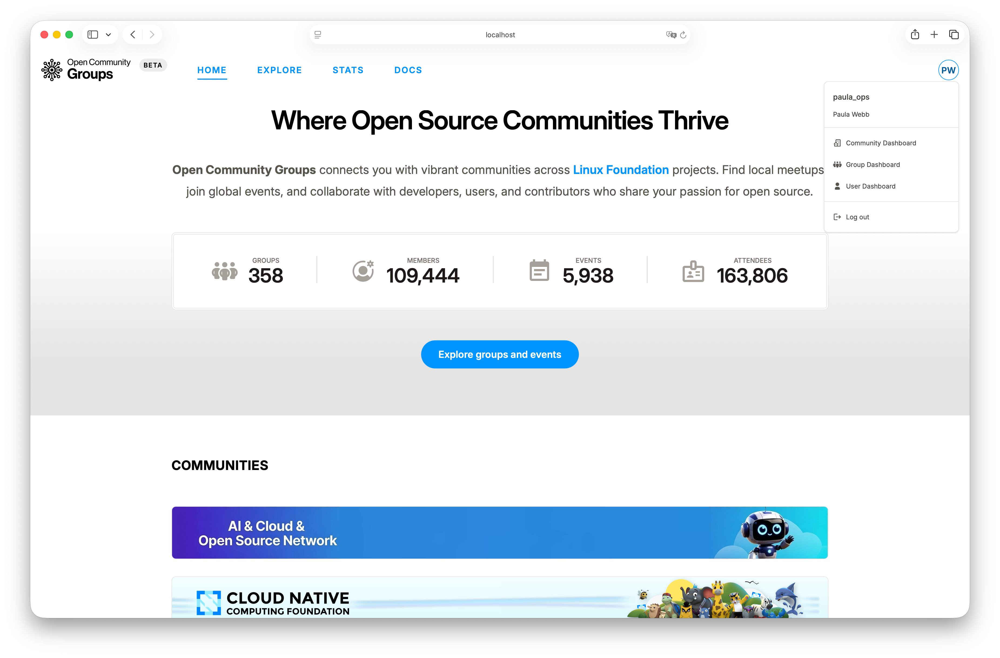

# Quickstart

Use this walkthrough to experience the core OCG flow in one sitting.

Estimated time: 10-15 minutes.

By the end, you will have discovered events and, if you sign in, joined a group, RSVP'd to an
event, and validated where your dashboard work happens.

## Optional: Sign In

Open [Log in](/log-in ':ignore'), choose `Linux Foundation SSO`, complete authentication, and
return to the [home page](/ ':ignore').

You can skip this step if you only want to browse public content. Sign-in is required for
membership actions, RSVP, submissions, and dashboard access.

> [!IMPORTANT]
> Sign-in is optional only for browsing public pages.
> Membership actions, RSVP, submissions, and dashboard access require login.

## Explore Events and Groups

From [Explore](/explore ':ignore'), start with `Events` to see what is happening soon, then switch to
`Groups` to find where you want to participate long term.

A practical pattern is:

> [!TIP]
> Start broad, then narrow: community first, then one or two filters.

1. Narrow by community first.
2. Add one or two filters (type, region, category).
3. Choose the view that fits your goal:
   - `Events`: `List` for scanning and `Calendar` for planning.
   - `Groups`: `List` for scanning and `Map` for location-based discovery.

For deeper discovery patterns and participation mechanics, see
[Public Site Guide](../guides/public-site.md).

## Join a Group You Care About

Open a group page and click `Join group`. This turns your account into an active member of that
specific group, which unlocks member-level communications and creates a cleaner path to event
participation.

If you later decide to stop following that group, `Leave group` reverses the membership cleanly.

After joining, OCG sends a welcome message with a link back to the group page.

## RSVP to an Event

From the group page or explore results, open an event and click `Attend event`.

This action records your attendance intent and is the basis for event-day check-in. For live
virtual/hybrid events that have meeting information configured, attendees can also get `Join
meeting` access at the right time window.

After RSVP, OCG sends a confirmation message with a calendar attachment.

## Apply to Speak at an Event

If an event has Call for Speakers open, create a proposal in
[`User Dashboard -> Session proposals`](/dashboard/user?tab=session-proposals ':ignore'), then submit that
proposal from the event page.

After submission, track lifecycle changes in
[`User Dashboard -> Submissions`](/dashboard/user?tab=submissions ':ignore').

For speaker-side status detail, see [User Dashboard Guide](../guides/user-dashboard.md). For
organizer-side CFS and review controls, see [Event Operations](../guides/event-operations.md).

## Validate Your Dashboard Access

Open your avatar menu in the top-right corner to confirm which dashboard scopes your account has
right now. This step requires logging in with Linux Foundation SSO.

- [`User Dashboard`](/dashboard/user ':ignore') is available to all logged-in users.
- [`Community Dashboard`](/dashboard/community ':ignore') appears when you have community-team access.
- [`Group Dashboard`](/dashboard/group ':ignore') appears when you have group-team access.

If you are unsure which workspace to use next, continue with
[Choose Your Dashboard](choose-dashboard.md).

