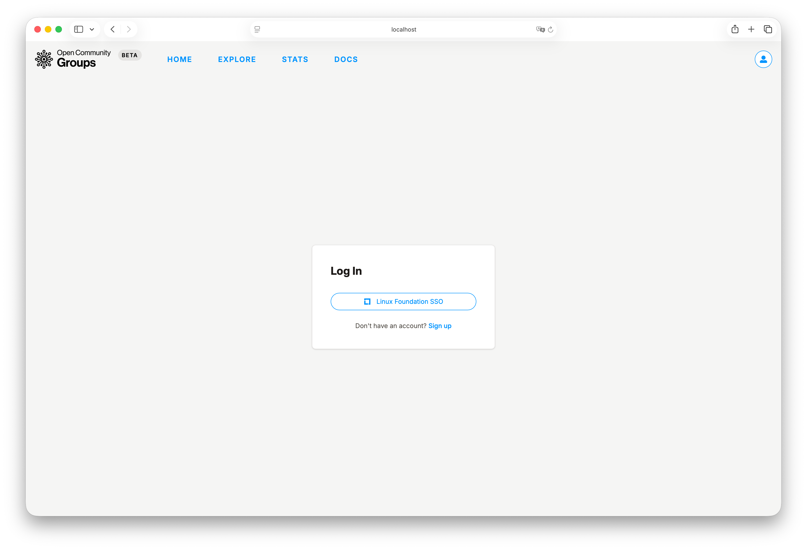
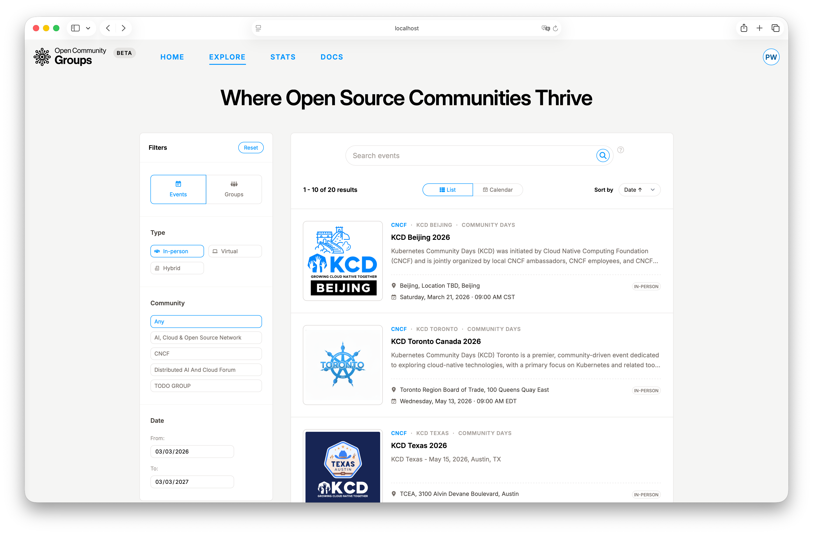
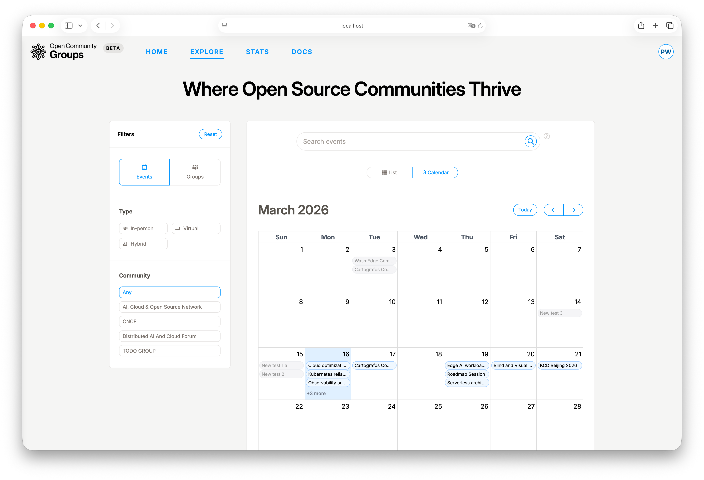
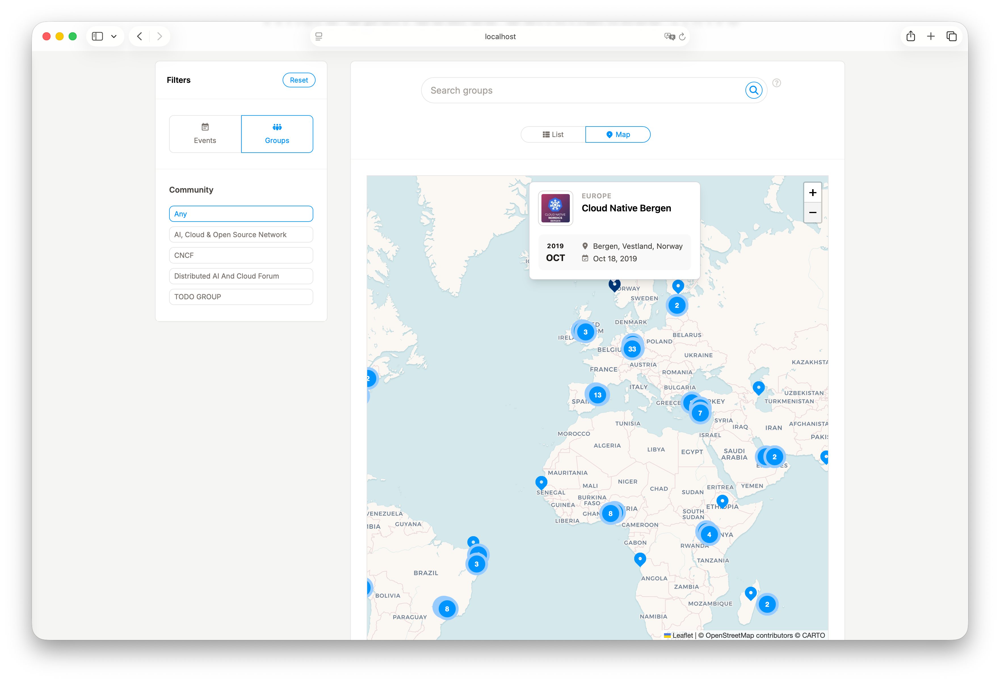
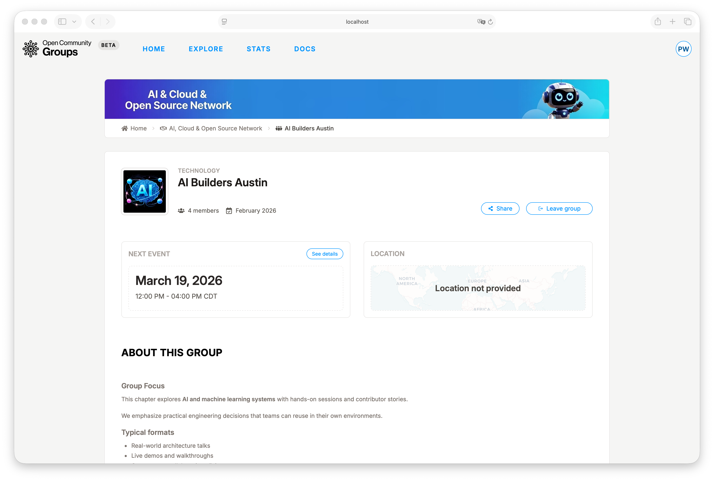
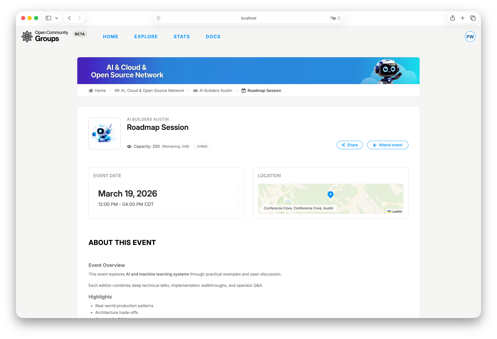
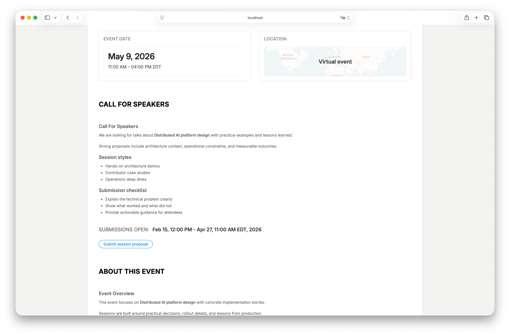
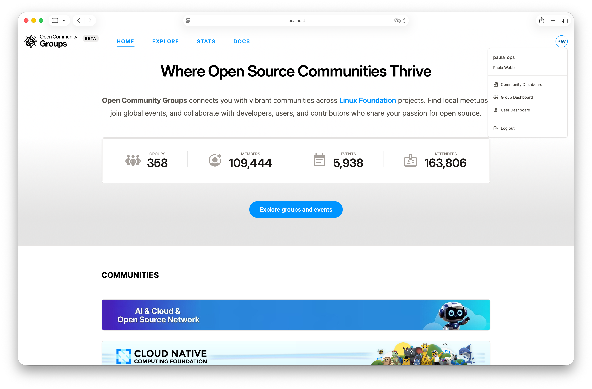

# Quickstart

This walkthrough takes you through the core OCG flow in one sitting, in
about 10 to 15 minutes. By the end, you will have discovered events and, if
you sign in, joined a group, enrolled in an event, and seen which dashboards
are available to you.

## Optional: Sign In

Open [Log in](/log-in ':ignore'), choose `Linux Foundation SSO`, complete
authentication, and return to the [home page](/ ':ignore').

!> You can skip sign-in if you only want to browse public pages.
Membership actions, RSVP, submissions, and dashboard access require login.

## Explore Events and Groups

From [Explore](/explore ':ignore'), start with `Events` to see what is
happening soon, then switch to `Groups` to find where you want to participate
long term.

A practical pattern is to start broad and narrow down step by step:

?> Start broad, then narrow: community first, then one or two filters.

1. Narrow by community first.
2. Add one or two filters (type, region, category).
3. Choose the view that fits your goal:
   - `Events`: `List` for scanning and `Calendar` for planning.
   - `Groups`: `List` for scanning and `Map` for location-based discovery.

For deeper discovery patterns and participation mechanics, see
[Public Site Guide](../guides/public-site.md).

## Join a Group You Care About

Open a group page and click `Join group`. This turns your account into an
active member of that specific group, which unlocks member-level communications
and creates a cleaner path to event participation. After joining, OCG sends a
welcome message with a link back to the group page.

If you later decide to stop following that group, `Leave group` reverses the
membership cleanly.

## Attend an Event

From the group page or explore results, open an event. An event with one free
public admission tier uses the simple `Attend event` action. Events with more
choices use `Get free ticket`, `Get ticket`, or `Request ticket`, depending on
their configuration. Free admission completes inside OCG, while a positive
price may continue through hosted checkout.

After attendance is confirmed, OCG sends a confirmation message with a calendar
attachment. For live virtual or hybrid events with meeting information,
attendees can also use `Join meeting` during the configured access window.

If an admission tier is full, you may see `Join waiting list`. Each sold-out
public tier has its own waiting list. A promotion creates a time-limited offer in
[User Dashboard -> Invitations](/dashboard/user?tab=invitations ':ignore')
rather than confirming attendance immediately.

## Apply to Speak at an Event

If an event has Call for Speakers open, create a proposal in
[User Dashboard -> Session proposals](/dashboard/user?tab=session-proposals ':ignore'),
then submit that proposal from the event page. Once submitted, you can track
lifecycle changes in
[User Dashboard -> Submissions](/dashboard/user?tab=submissions ':ignore').

For speaker-side status detail, see
[User Dashboard Guide](../guides/user-dashboard.md). For organizer-side CFS and
review controls, see [Event Operations](../guides/event-operations.md).

## Validate Your Dashboard Access

Open your avatar menu in the top-right corner to confirm which dashboard scopes
your account has right now. This step requires logging in with Linux Foundation
SSO.

- [User Dashboard](/dashboard/user ':ignore') is available to all logged-in
  users.
- [Community Dashboard](/dashboard/community ':ignore') appears when you have
  community-team access.
- [Group Dashboard](/dashboard/group ':ignore') appears when you have
  group-team access.

If you are unsure which workspace to use next, continue with
[Choose Your Dashboard](choose-dashboard.md).

