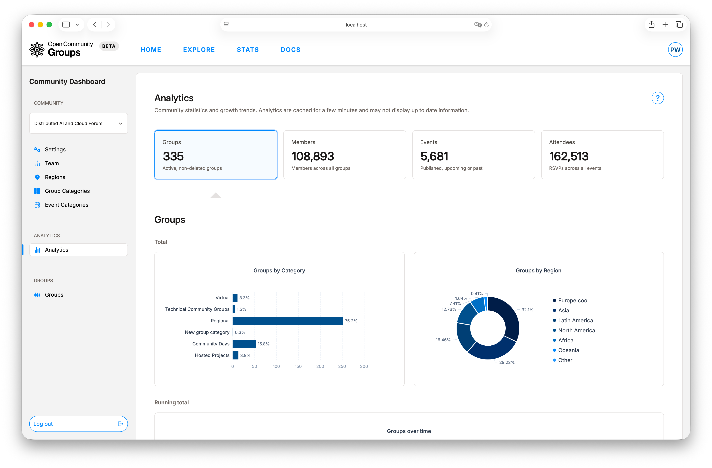
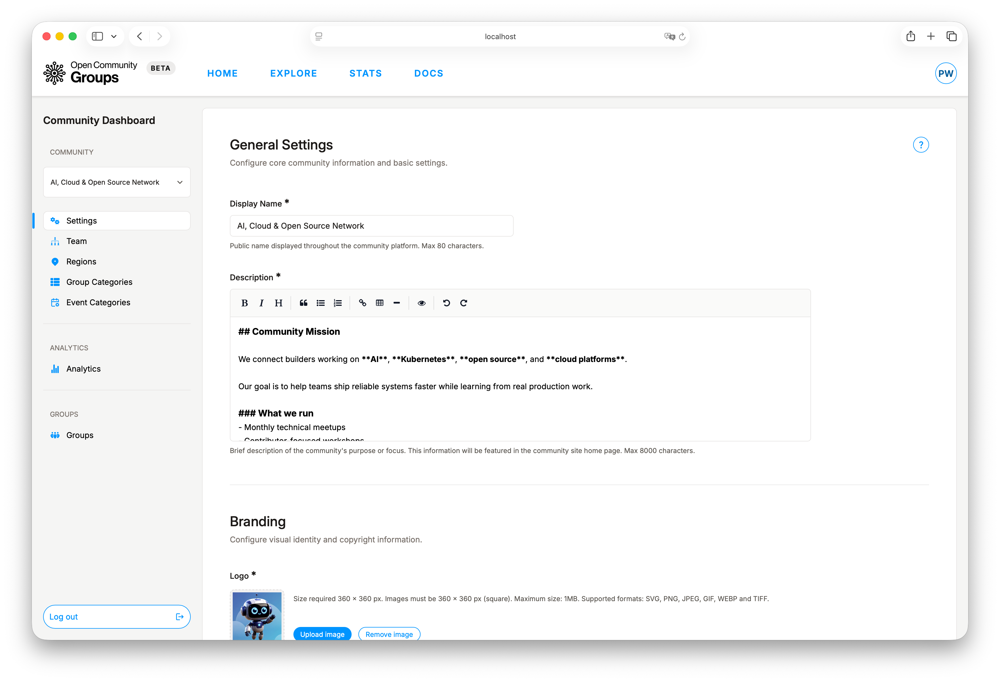
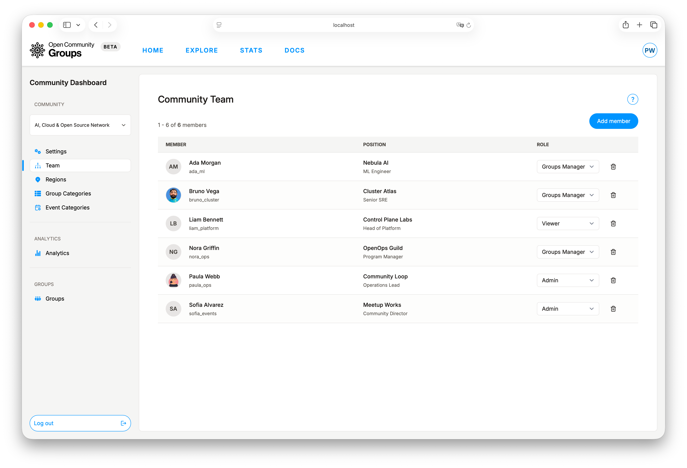
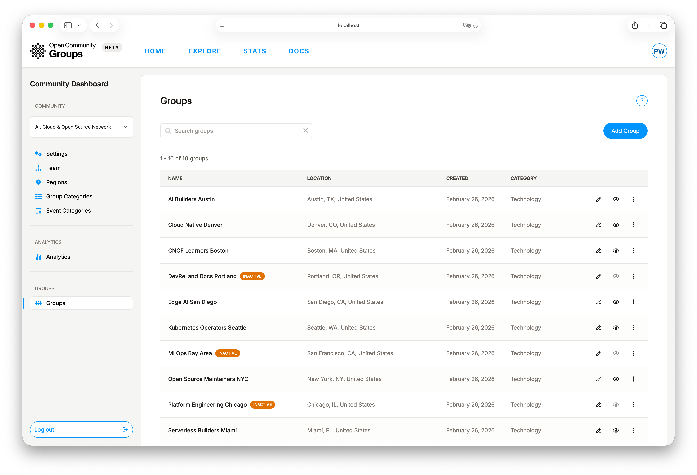
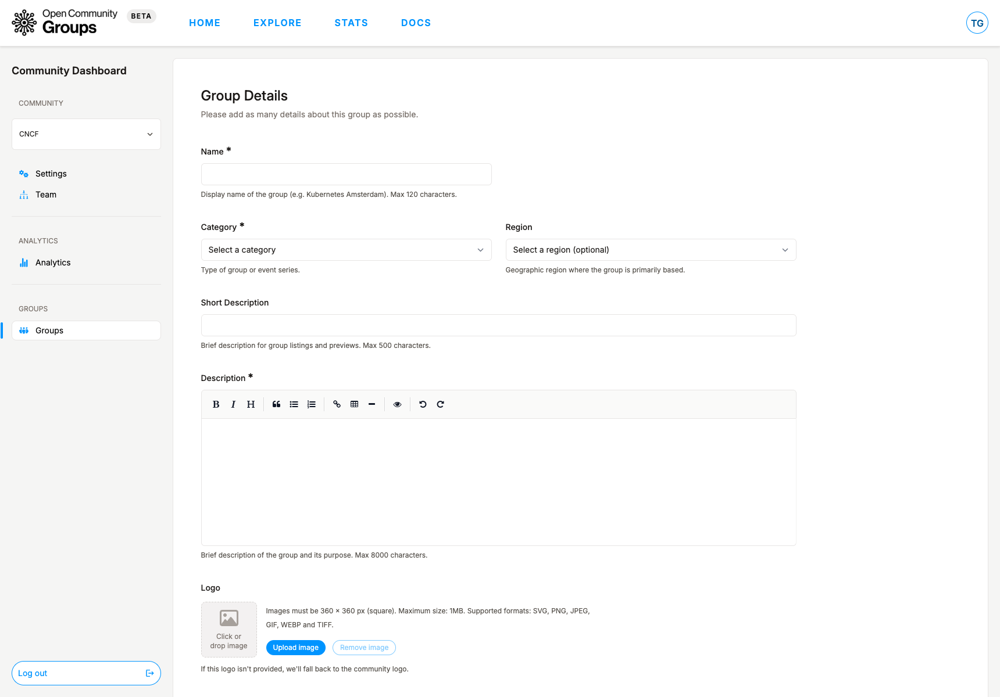

# Community Dashboard Guide

Use the Community Dashboard to manage strategy-level community operations: identity, governance,
team access, analytics, and group lifecycle.

If you are deciding workspace scope first, read
[Choose Your Dashboard](../getting-started/choose-dashboard.md).

Path: [`/dashboard/community`](/dashboard/community ':ignore')

**Sections:**

- [What This Dashboard Owns](#what-this-dashboard-owns)
- [Access and Context](#access-and-context)
- [Settings: Community Identity](#settings-community-identity)
- [Team: Community Access](#team-community-access)
- [Analytics: Momentum](#analytics-momentum)
- [Groups: Portfolio](#groups-portfolio)
- [Recommended Cadence](#recommended-cadence)

## What This Dashboard Owns

Think of the community scope as the layer above groups. You are not running one event here; you
are shaping how the whole community is represented and governed.

Main areas:

- [`Settings`](/dashboard/community?tab=settings ':ignore'): community identity, branding, social presence,
  and long-form content.
- [`Team`](/dashboard/community?tab=team ':ignore'): community-level admins and invitation flow.
- [`Analytics`](/dashboard/community?tab=analytics ':ignore'): community growth trends and volume metrics.
- [`Groups`](/dashboard/community?tab=groups ':ignore'): group creation, maintenance, activation state,
  and lifecycle transitions.

## Access and Context

You are ready to work in this dashboard when:

1. You are logged in.
2. Your account is on the community team.
3. A community is selected in dashboard context.

If no community is selected yet, some actions stay unavailable until you choose one.

Invitation acceptance and access visibility are managed in
[User Dashboard Guide](user-dashboard.md).

## Settings: Community Identity

`Settings` is where you shape how the community appears publicly and how organizers enrich it over
time.

Key sections include:

- General Settings.
- Branding.
- Social Links.
- Advertisement (coming soon on the public site; not displayed yet).
- Additional Content.

Common use cases:

- Keeping display name and description up to date.
- Maintaining logo/banner assets for consistent presentation.
- Managing social links, optional ad placements, gallery images, tags, and extra links.

Field requirements, character limits, and list limits are shown inline in the settings UI.

## Team: Community Access

Use `Team` to invite or remove community admins.

OCG blocks removal of the final accepted team member, so a community is never left without an
accountable owner.

Pending states are visible (`Invitation sent`) so you can tell the difference between invited and
fully active collaborators.

When you add a team member, OCG sends an invitation with a direct link to
[`User Dashboard -> Invitations`](/dashboard/user?tab=invitations ':ignore').

## Analytics: Momentum

Community analytics shows totals and trends for:

- Groups.
- Members.
- Events.
- Attendees.

Each metric is available as total, running total, and monthly values. This helps you spot
steady progress and notice unusual jumps with better context.

Analytics data is cached and may lag for a few minutes.

## Groups: Portfolio

`Groups` is where community leads create and maintain the collection of groups under the
community umbrella.

You can:

- Search groups.
- Add or update groups.
- Activate/deactivate groups.
- Delete retired groups.
- Open a group in [Group Dashboard](/dashboard/group ':ignore') for deeper operational work.

For execution workflows inside a specific group, continue with
[Group Dashboard Guide](group-dashboard.md).

Activity states:

- `Active`: group is available for normal public participation.
- `Inactive`: group is paused and can be reactivated later.

When creating a new group, `Add Group` starts with the basics first. Then you can add branding,
location, links, and optional content before launch.

Group-branding inheritance from this flow:

- If group logo is empty, the public group view uses the community logo.
- If group banner/mobile banner is empty, the public group view uses the community banner.

### Group Lifecycle

- `Activate` restores visibility and operational flow.
- `Deactivate` pauses activity while preserving metadata.
- `Delete` is permanent retirement for groups that should no longer exist operationally.

When a group is inactive, its public-view shortcut is disabled in the groups table.

## Recommended Cadence

1. Review [`Settings`](/dashboard/community?tab=settings ':ignore') monthly for brand accuracy.
2. Keep [`Team`](/dashboard/community?tab=team ':ignore') membership current to avoid operational
   bottlenecks.
3. Check [`Analytics`](/dashboard/community?tab=analytics ':ignore') on a regular cadence for trend shifts.
4. Use [`Groups`](/dashboard/community?tab=groups ':ignore') to retire stale structures and support active
   ones.

For event lifecycle operations after handoff to group teams, see
[Event Operations](event-operations.md).
