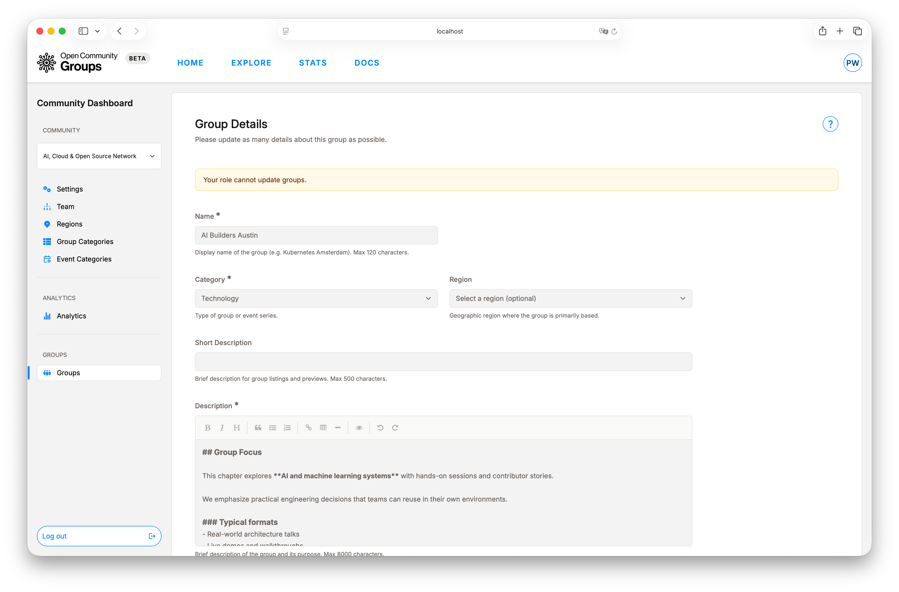

<!-- markdownlint-disable MD013 -->

# Community Dashboard Guide

Use the Community Dashboard to manage community-wide settings and operations:
identity, governance, taxonomy, team access, analytics, and groups.

If you are deciding workspace scope first, read
[Choose Your Dashboard](../getting-started/choose-dashboard.md).

Path: [/dashboard/community](/dashboard/community ':ignore')

**Sections:**

- [What This Dashboard Owns](#what-this-dashboard-owns)
- [Access and Context](#access-and-context)
- [Roles and Permissions](#roles-and-permissions)
- [Settings: Community Identity](#settings-community-identity)
- [Team: Community Access](#team-community-access)
- [Regions: Geographic Scope](#regions-geographic-scope)
- [Group Categories: Group Taxonomy](#group-categories-group-taxonomy)
- [Event Categories: Event Taxonomy](#event-categories-event-taxonomy)
- [Analytics: Momentum](#analytics-momentum)
- [Groups: Portfolio](#groups-portfolio)
- [Audit: Logs](#audit-logs)
- [Recommended Cadence](#recommended-cadence)

## What This Dashboard Owns

Use the community scope to manage the structure shared by all groups. You are
not running one event here; you are shaping how the whole community is
presented and managed.

Main areas:

- [Settings](/dashboard/community?tab=settings ':ignore'): community identity, branding, social presence,
  and long-form content.
- [Team](/dashboard/community?tab=team ':ignore'): community-level admins and invitation flow.
- [Regions](/dashboard/community?tab=regions ':ignore'): community geography model for group classification.
- [Group Categories](/dashboard/community?tab=group-categories ':ignore'): reusable taxonomy for groups.
- [Event Categories](/dashboard/community?tab=event-categories ':ignore'): reusable taxonomy for events.
- [Analytics](/dashboard/community?tab=analytics ':ignore'): community growth trends and volume metrics.
- [Groups](/dashboard/community?tab=groups ':ignore'): group creation, maintenance, activation state,
  and lifecycle transitions.
- [Logs](/dashboard/community?tab=logs ':ignore'): read-only audit trail for community dashboard actions.

## Access and Context

You are ready to work in this dashboard when:

1. You are logged in.
2. Your account is on the community team.
3. A community is selected in dashboard context.

If no community is selected yet, some actions stay unavailable until you choose one.

For invitation acceptance and dashboard access, see
[User Dashboard Guide](user-dashboard.md).

## Roles and Permissions

Community role permissions are fixed:

| Community role   | Community read | Groups    | Settings  | Taxonomy  | Team      |
| ---------------- | -------------- | --------- | --------- | --------- | --------- |
| `admin`          | Yes            | Write     | Write     | Write     | Write     |
| `groups-manager` | Yes            | Write     | Read only | Read only | Read only |
| `viewer`         | Yes            | Read only | Read only | Read only | Read only |

Community roles also affect group-level operations in the same community. `admin` and
`groups-manager` can perform group write operations (`events`, `members`, `settings`, `sponsors`,
`team`) without needing a group-team role assignment, while `viewer` keeps read-only visibility.
If `Restrict group team management` is enabled in community settings, group team management
(`team`) is limited to the community `admin` and `groups-manager` roles.

When your role cannot perform an action, the UI disables those controls, and OCG enforces the
same permissions on every operation.

## Settings: Community Identity

`Settings` is where you shape how the community appears publicly and how organizers enrich it over
time. Key sections include General Settings, Branding, Social Links, Advertisement, and
Additional Content.

Most of the time you will use this tab to keep the display name and description up to date, to
maintain logo, banner, and Open Graph preview assets for consistent presentation, and to manage
social links, optional ad placements, gallery images, tags, and extra links. It is also where you
can restrict group team management to community admins and groups managers when policy requires
it.

Advertisement settings are community-wide. When a banner image is configured, OCG shows it on the
public community page and as a floating banner on public group and event pages for that community.
The optional banner link URL makes the banner clickable.

Field requirements, character limits, and list limits are shown inline in the settings UI.

## Team: Community Access

Use `Team` to invite members with a community role, update existing roles, or remove members. The
assignable roles are `admin`, `groups-manager`, and `viewer`.

As a safety rule, OCG blocks removing the final accepted community admin, and also blocks demoting
that admin to a non-admin role.

!> The final accepted community admin cannot be removed or demoted.
Add another accepted member first, then retry removal.

Pending states are visible (`Invitation sent`) so you can tell the difference between invited and
fully active collaborators.

When you add a team member, OCG sends an invitation with a direct link to
[User Dashboard -> Invitations](/dashboard/user?tab=invitations ':ignore').

## Regions: Geographic Scope

`Regions` is the community-level geography list used by groups. From here you can add regions,
rename existing ones, and delete regions that have been retired.

Region names must be unique within the selected community, and you cannot delete a region while
one or more groups still use it. To make those dependencies visible before cleanup, the table
shows a `Groups` count for each region.

Downstream, group setup and edit forms select their region values from this list, and public
discovery and filtering can use region as a search dimension.

## Group Categories: Group Taxonomy

`Group Categories` defines reusable category values for all groups in the selected community. As
with regions, you can add categories, rename existing ones, and delete the ones no longer in use.

Group category names must be unique within the selected community, and deletion is blocked while
one or more groups still use a category. The `Groups` count shown per category helps you check
dependencies before removing anything.

These values feed the group setup and edit forms, and public discovery and filtering can use
group category as a search dimension.

## Event Categories: Event Taxonomy

`Event Categories` defines reusable category values for events across the selected community. The
workflow is the same as for the other taxonomy tabs: add event categories, rename existing ones,
and delete unused ones.

Event category names must be unique within the selected community, and a category cannot be
deleted while one or more events still use it. The table shows an `Events` count per category for
dependency checks.

Downstream, the event editor (`Details` tab) uses this list for event categorization, and public
event discovery and filtering can use event category.

## Analytics: Momentum

Community analytics shows totals and trends for groups, members, events, attendees, and page
views across the community page, all group pages, and all event pages.

Each metric is available as total, running total, and monthly values. This helps you spot
steady progress and notice unusual jumps with better context.

The `Page views` tab starts with total community, group, and event page views, then breaks
views down by page type with daily charts for the last month.

Analytics data is cached and may lag for a few minutes.

## Groups: Portfolio

`Groups` is where community leads create and maintain the collection of groups under the
community umbrella.

Group records rely on taxonomy values from community-level `Regions` and `Group Categories`.

From here you can search groups, add or update them, activate or deactivate them, delete retired
ones, and open any group in [Group Dashboard](/dashboard/group ':ignore') for deeper operational
work.

The add and update forms also include an optional `Parent group` selector. Use it to create a
single-level subgroup relationship during community-level group maintenance.

The selector follows these rules:

- Candidates are active, same-community groups that are not deleted and are not already subgroups.
- You must be able to manage the selected parent group.
- A group cannot be its own parent.
- A group with any non-deleted child link cannot be assigned a parent; the selector is disabled on
  that update form.
- Clearing an existing parent only requires permission to update the group being edited.
- Saving without changing the current parent is allowed, even if that parent is no longer active.

For execution workflows inside a specific group, continue with
[Group Dashboard Guide](group-dashboard.md).

A group is either `Active`, meaning it is available for normal public participation, or
`Inactive`, meaning it is paused and can be reactivated later.

When creating a new group, `Add Group` starts with the basics first. Then you can add branding,
location, links, and optional content before launch.

Group-branding inheritance also applies from this flow: if the group logo is empty, the public
group view uses the community logo, and if the group banner or mobile banner is empty, the public
group view uses the community banner.

### Group Lifecycle

`Activate` restores visibility and operational flow, while `Deactivate` pauses activity while
preserving metadata. `Delete` is permanent retirement for groups that should no longer exist
operationally.

When a group is inactive, its public-view shortcut is disabled in the groups table.

## Audit: Logs

`AUDIT -> Logs` is the last section in the left dashboard menu. It gives community leads a
read-only activity stream for community dashboard operations.

Coverage in this view includes:

- Community settings updates.
- Community team membership changes, including invitation accept and reject outcomes.
- Region, group category, and event category changes.
- Group portfolio actions done from the community dashboard, including add, activate, deactivate,
  delete, and update.

Rows are ordered by newest first by default, and you can switch the ordering to oldest first. You
can filter by `Action`, `Actor`, and date range, and pagination keeps the active filters applied.
When an audit row has extra metadata, `Details` opens a popover with it.

For each entry, OCG shows the resource type plus the current resource name. If the resource no
longer exists, the audit entry still remains and falls back to the name recorded when the action
happened when available, or to the stored resource identifier.

This screen is community-dashboard focused, but some overlapping actions, such as
`group_updated`, can also appear in the group dashboard audit view when they match that
dashboard's accepted scope.

## Recommended Cadence

?> Use a recurring monthly or biweekly rhythm so identity, access, and group structure stay healthy.

1. Review [Settings](/dashboard/community?tab=settings ':ignore') monthly for brand accuracy.
2. Keep [Team](/dashboard/community?tab=team ':ignore') membership current to avoid operational
   bottlenecks.
3. Review [Regions](/dashboard/community?tab=regions ':ignore') so geography labels stay clean and useful.
4. Review [Group Categories](/dashboard/community?tab=group-categories ':ignore') to avoid stale taxonomy.
5. Review [Event Categories](/dashboard/community?tab=event-categories ':ignore') as event programs evolve.
6. Check [Analytics](/dashboard/community?tab=analytics ':ignore') on a regular cadence for trend shifts.
7. Use [Groups](/dashboard/community?tab=groups ':ignore') to retire stale structures and support active
   ones.

For event lifecycle operations after handoff to group teams, see
[Event Operations](event-operations.md).
