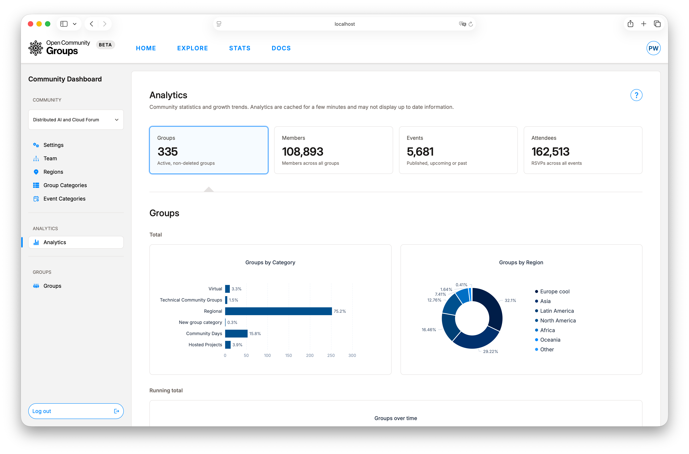
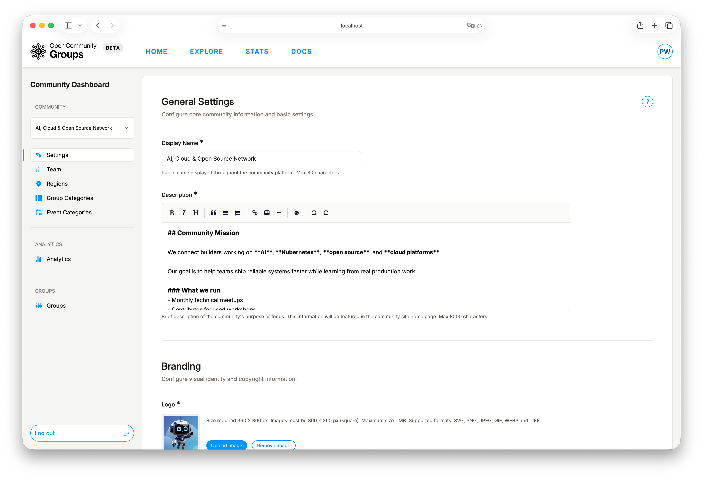
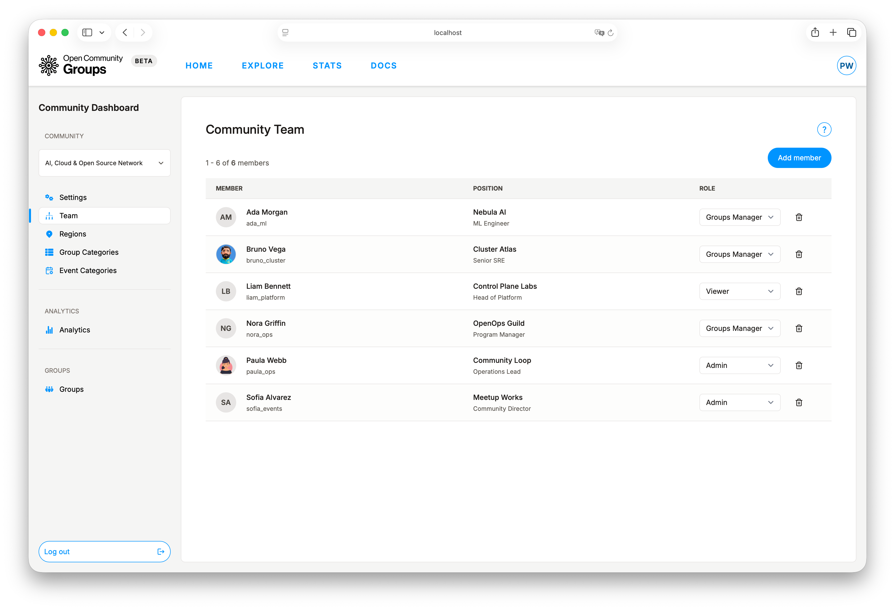
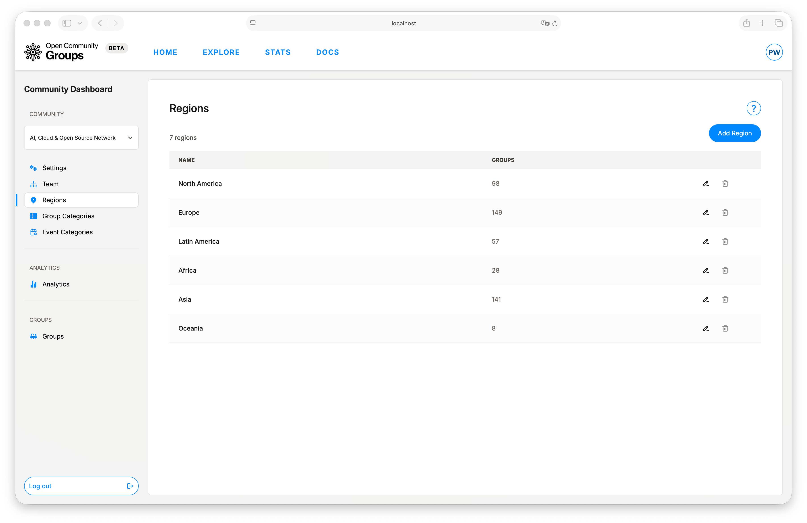
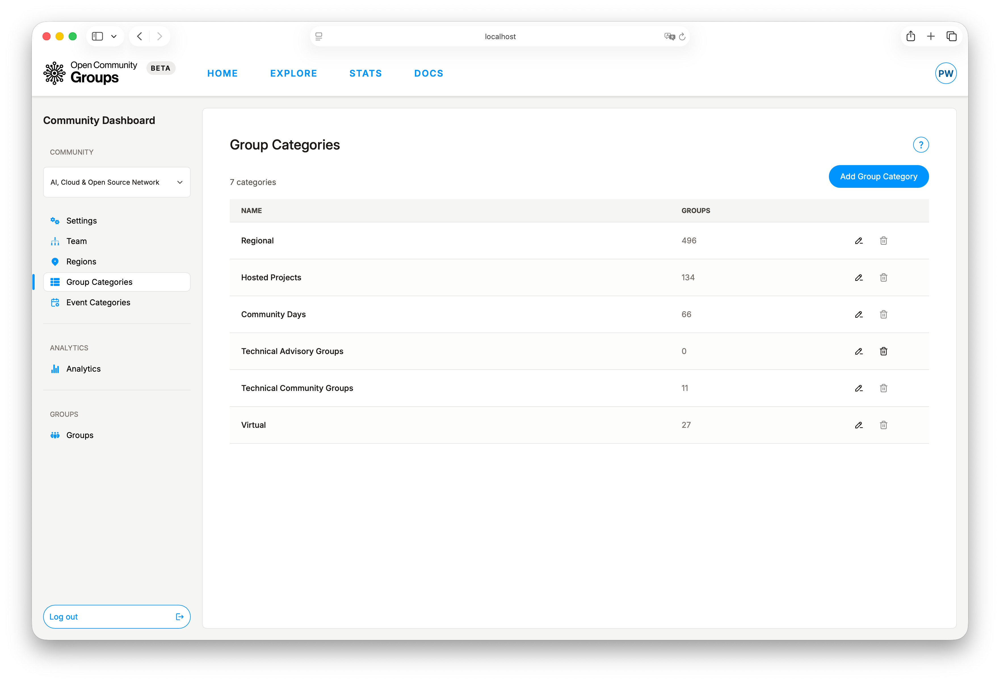
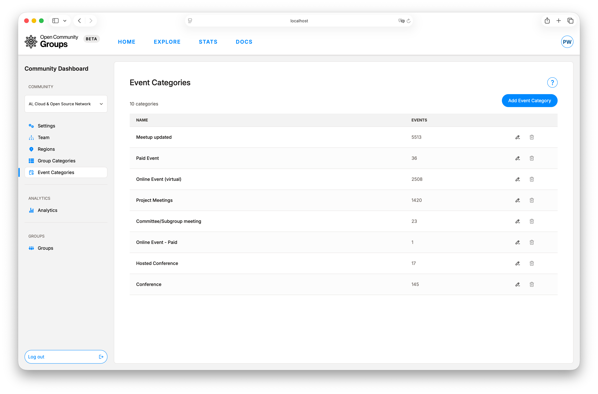
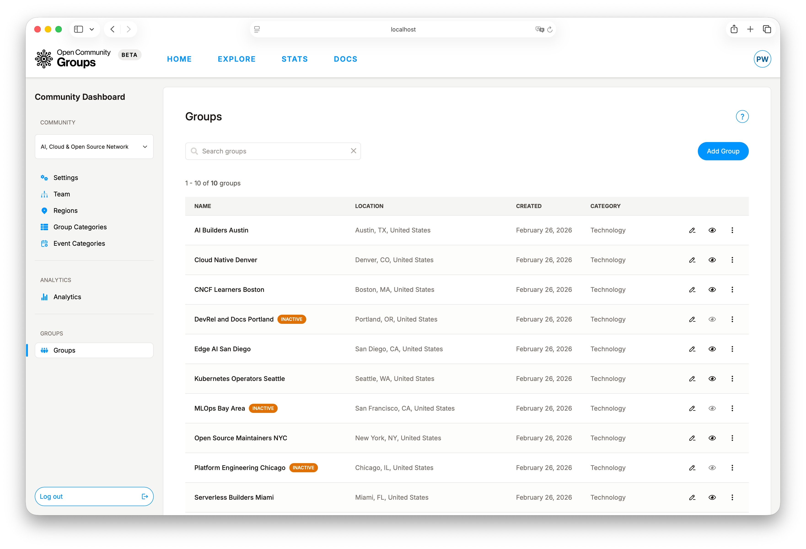
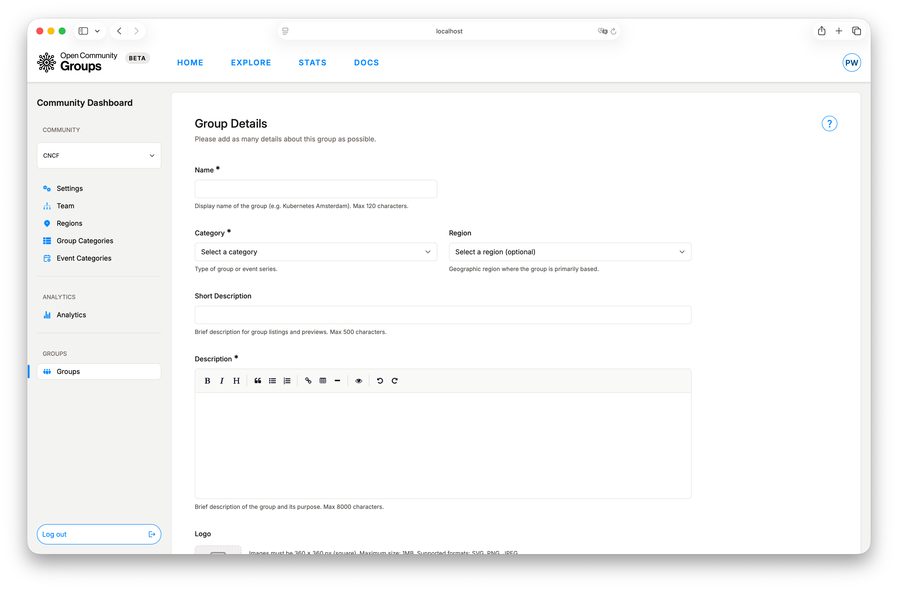
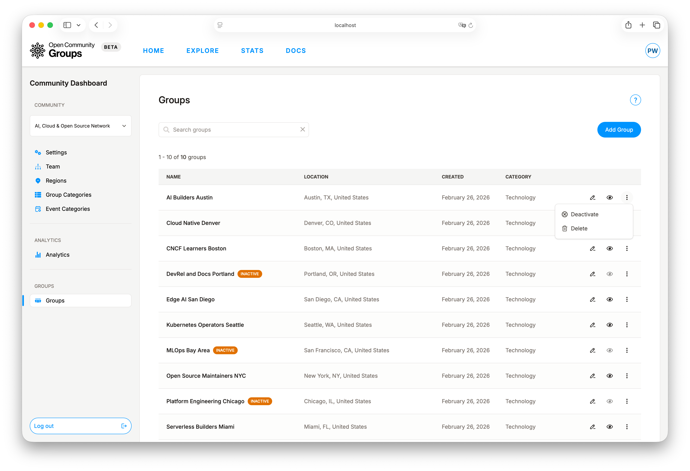

<!-- markdownlint-disable MD013 -->

# Community Dashboard Guide

Use the Community Dashboard to manage strategy-level community operations: identity, governance,
taxonomy, team access, analytics, and group lifecycle.

If you are deciding workspace scope first, read
[Choose Your Dashboard](../getting-started/choose-dashboard.md).

Path: [`/dashboard/community`](/dashboard/community ':ignore')

**Sections:**

- [What This Dashboard Owns](#what-this-dashboard-owns)
- [Access and Context](#access-and-context)
- [Roles and Permissions](#roles-and-permissions)
- [Settings: Community Identity](#settings-community-identity)
- [Team: Community Access](#team-community-access)
- [Regions: Geographic Scope](#regions-geographic-scope)
- [Group Categories: Group Taxonomy](#group-categories-group-taxonomy)
- [Event Categories: Event Taxonomy](#event-categories-event-taxonomy)
- [Analytics: Momentum](#analytics-momentum)
- [Groups: Portfolio](#groups-portfolio)
- [Recommended Cadence](#recommended-cadence)

## What This Dashboard Owns

Think of the community scope as the layer above groups. You are not running one event here; you
are shaping how the whole community is represented and governed.

Main areas:

- [`Settings`](/dashboard/community?tab=settings ':ignore'): community identity, branding, social presence,
  and long-form content.
- [`Team`](/dashboard/community?tab=team ':ignore'): community-level admins and invitation flow.
- [`Regions`](/dashboard/community?tab=regions ':ignore'): community geography model for group classification.
- [`Group Categories`](/dashboard/community?tab=group-categories ':ignore'): reusable taxonomy for groups.
- [`Event Categories`](/dashboard/community?tab=event-categories ':ignore'): reusable taxonomy for events.
- [`Analytics`](/dashboard/community?tab=analytics ':ignore'): community growth trends and volume metrics.
- [`Groups`](/dashboard/community?tab=groups ':ignore'): group creation, maintenance, activation state,
  and lifecycle transitions.

## Access and Context

You are ready to work in this dashboard when:

1. You are logged in.
2. Your account is on the community team.
3. A community is selected in dashboard context.

If no community is selected yet, some actions stay unavailable until you choose one.

Invitation acceptance and access visibility are managed in
[User Dashboard Guide](user-dashboard.md).

## Roles and Permissions

Community role permissions are fixed and enforced by middleware plus database checks:

| Community role | Community read | Groups | Settings | Taxonomy | Team |
| --- | --- | --- | --- | --- | --- |
| `admin` | Yes | Write | Write | Write | Write |
| `groups-manager` | Yes | Write | Read only | Read only | Read only |
| `viewer` | Yes | Read only | Read only | Read only | Read only |

Community role impact on group-level operations in the same community:

- `admin` and `groups-manager` can perform group write operations (`events`, `members`,
  `settings`, `sponsors`, `team`) without needing group-team role assignment.
- `viewer` keeps read-only visibility.

UI behavior:

- When your role cannot perform an action, controls are disabled.
- Authorization middleware is the source of truth and blocks unauthorized requests.

## Settings: Community Identity

`Settings` is where you shape how the community appears publicly and how organizers enrich it over
time.

Key sections include:

- General Settings.
- Branding.
- Social Links.
- Advertisement (coming soon on the public site; not displayed yet).
- Additional Content.

Common use cases:

- Keeping display name and description up to date.
- Maintaining logo/banner assets for consistent presentation.
- Managing social links, optional ad placements, gallery images, tags, and extra links.

Field requirements, character limits, and list limits are shown inline in the settings UI.

## Team: Community Access

Use `Team` to invite members with a community role, update existing roles, or remove members.

Current assignable roles:

- `admin`
- `groups-manager`
- `viewer`

Safety rules:

- OCG blocks removing the final accepted community admin.
- OCG blocks demoting the final accepted community admin to a non-admin role.

!> The final accepted community admin cannot be removed or demoted.
Add another accepted member first, then retry removal.

Pending states are visible (`Invitation sent`) so you can tell the difference between invited and
fully active collaborators.

When you add a team member, OCG sends an invitation with a direct link to
[`User Dashboard -> Invitations`](/dashboard/user?tab=invitations ':ignore').

## Regions: Geographic Scope

`Regions` is the community-level geography list used by groups.

You can:

- Add regions.
- Rename existing regions.
- Delete retired regions.

Operational rules:

- Region names must be unique within the selected community.
- Deletion is blocked when one or more groups still use that region.
- The table shows a `Groups` count to make dependencies visible before cleanup.

Where this appears downstream:

- Group setup/edit forms select region values from this list.
- Public discovery and filtering can use region as a search dimension.

## Group Categories: Group Taxonomy

`Group Categories` defines reusable category values for all groups in the selected community.

You can:

- Add group categories.
- Rename existing categories.
- Delete unused categories.

Operational rules:

- Group category names must be unique within the selected community.
- Deletion is blocked when one or more groups still use that category.
- The table shows a `Groups` count per category for dependency checks.

Where this appears downstream:

- Group setup/edit forms select category values from this list.
- Public discovery and filtering can use group category as a search dimension.

## Event Categories: Event Taxonomy

`Event Categories` defines reusable category values for events across the selected community.

You can:

- Add event categories.
- Rename existing categories.
- Delete unused categories.

Operational rules:

- Event category names must be unique within the selected community.
- Deletion is blocked when one or more events still use that category.
- The table shows an `Events` count per category for dependency checks.

Where this appears downstream:

- Event editor (`Details` tab) uses this list for event categorization.
- Public event discovery and filtering can use event category.

## Analytics: Momentum

Community analytics shows totals and trends for:

- Groups.
- Members.
- Events.
- Attendees.

Each metric is available as total, running total, and monthly values. This helps you spot
steady progress and notice unusual jumps with better context.

Analytics data is cached and may lag for a few minutes.

## Groups: Portfolio

`Groups` is where community leads create and maintain the collection of groups under the
community umbrella.

Group records rely on taxonomy values from community-level `Regions` and `Group Categories`.

You can:

- Search groups.
- Add or update groups.
- Activate/deactivate groups.
- Delete retired groups.
- Open a group in [Group Dashboard](/dashboard/group ':ignore') for deeper operational work.

For execution workflows inside a specific group, continue with
[Group Dashboard Guide](group-dashboard.md).

Activity states:

- `Active`: group is available for normal public participation.
- `Inactive`: group is paused and can be reactivated later.

When creating a new group, `Add Group` starts with the basics first. Then you can add branding,
location, links, and optional content before launch.

Group-branding inheritance from this flow:

- If group logo is empty, the public group view uses the community logo.
- If group banner/mobile banner is empty, the public group view uses the community banner.

### Group Lifecycle

- `Activate` restores visibility and operational flow.
- `Deactivate` pauses activity while preserving metadata.
- `Delete` is permanent retirement for groups that should no longer exist operationally.

When a group is inactive, its public-view shortcut is disabled in the groups table.

## Recommended Cadence

?> Use a recurring monthly or biweekly rhythm so identity, access, and group structure stay healthy.

1. Review [`Settings`](/dashboard/community?tab=settings ':ignore') monthly for brand accuracy.
2. Keep [`Team`](/dashboard/community?tab=team ':ignore') membership current to avoid operational
   bottlenecks.
3. Review [`Regions`](/dashboard/community?tab=regions ':ignore') so geography labels stay clean and useful.
4. Review [`Group Categories`](/dashboard/community?tab=group-categories ':ignore') to avoid stale taxonomy.
5. Review [`Event Categories`](/dashboard/community?tab=event-categories ':ignore') as event programs evolve.
6. Check [`Analytics`](/dashboard/community?tab=analytics ':ignore') on a regular cadence for trend shifts.
7. Use [`Groups`](/dashboard/community?tab=groups ':ignore') to retire stale structures and support active
   ones.

For event lifecycle operations after handoff to group teams, see
[Event Operations](event-operations.md).
