<!-- markdownlint-disable MD013 -->

# Event Operations

This guide covers the full event lifecycle in
[Group Dashboard -> Events](/dashboard/group?tab=events ':ignore'): draft creation, configuration,
publishing, delivery-day execution, and controlled retirement.

For scope boundaries and non-event responsibilities, pair this with
[Group Dashboard Guide](group-dashboard.md).

**Sections:**

- [Lifecycle Model](#lifecycle-model)
- [Authorization Model](#authorization-model)
- [Events List: Work Queue](#events-list-work-queue)
- [Add Event: Draft First](#add-event-draft-first)
- [Event Editor Tabs](#event-editor-tabs)
- [CFS Workflow (End to End)](#cfs-workflow-end-to-end)
- [Automatic Meeting Creation](#automatic-meeting-creation)
- [Attendance and Waitlist Operations](#attendance-and-waitlist-operations)
- [Publish, Unpublish, Cancel, Delete](#publish-unpublish-cancel-delete)
- [Public Event Result](#public-event-result)
- [Event-Day Checklist](#event-day-checklist)

## Lifecycle Model

Treat event operations as a staged workflow, not one big form submission:

1. Build a complete and trustworthy draft.
2. Publish only when attendee-facing data is ready.
3. Run delivery-day operations (attendance, check-in, communication).
4. Retire intentionally (unpublish, cancel, or delete).

When phase 1 is done well, every downstream step is faster and safer.

## Authorization Model

Event write operations require the `group.events.write` permission.

This is granted by:

- Group `admin`
- Group `events-manager`
- Community `admin`
- Community `groups-manager`

Read-only roles can still view event data but cannot mutate it.

UI behavior:

- Event action controls are disabled when your role cannot perform the operation.
- Middleware authorization is enforced server-side for every write endpoint.

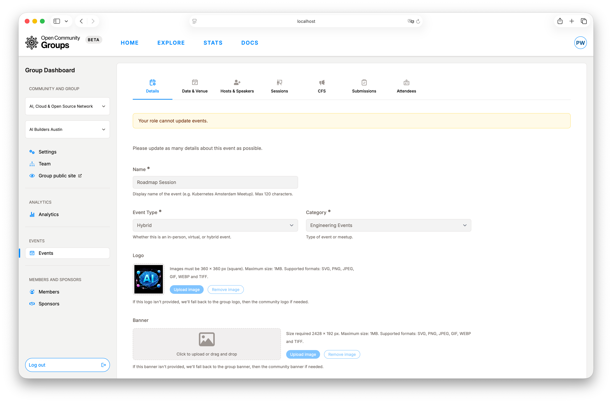

## Events List: Work Queue

[Events](/dashboard/group?tab=events ':ignore') is your organizer queue. `Upcoming events` and `Past events`
help you separate work that needs intervention now from historical cleanup.

From each row, you can:

- Create with [Add event](/dashboard/group?tab=events ':ignore').
- Open edit mode.
- Open the public event page (when available).
- Publish/unpublish.
- Cancel.
- Delete.

State intent:

- `Draft`: still being authored.
- `Published`: live for public participation.
- `Canceled`: visible as canceled and no longer running.

## Add Event: Draft First

The safest pattern is draft-first, publish-second.

Recommended flow:

1. Click `Add Event`.
2. Optionally copy an earlier event to reuse structure.
3. Complete each editor tab.
4. Save.
5. Publish only after a full quality pass.

Copying is intentionally partial so stale logistics are not carried forward:

?> After copying an event, run a quick logistics sweep before publishing.
Time-bound and meeting-specific fields are intentionally not carried forward.

- Start/end dates are cleared.
- Sessions are not copied.
- Meeting links are not copied.
- Some older host/speaker fields may need manual cleanup.

## Event Editor Tabs

The editor is organized so you can move from identity, to schedule, to speakers, to operations.

### Details

In this tab, you define attendee-facing identity and enrollment posture: name, event type,
category, description, branding assets, capacity, registration toggle, tags, and optional links.

Event category options come from the defined community's
[Event Categories](/dashboard/community?tab=event-categories ':ignore') tab.

Publish readiness checks in this tab:

- Name, type, category, and description are complete and clear.
- Branding is consistent with group/community standards.
- Capacity and registration policy match expected demand.

Waitlist control also lives here:

- `Waitlist enabled` is an explicit toggle, separate from `capacity`.
- Enabling the waitlist requires a numeric capacity value.
- Leaving `Capacity` blank makes the event unlimited-capacity, and unlimited-capacity events cannot
  enable waitlist.
- If capacity is full and waitlist is off, the public page shows the event as sold out.
- If capacity is full and waitlist is on, people can join the waitlist instead of RSVP'ing.

!> If you want a waitlist, set capacity first.
Unlimited-capacity events always keep waitlist disabled.

Brand inheritance model in event details:

- If event logo is not provided, OCG falls back to group logo, then community logo.
- If event banner or mobile banner is not provided, OCG falls back to group banner, then
  community banner.

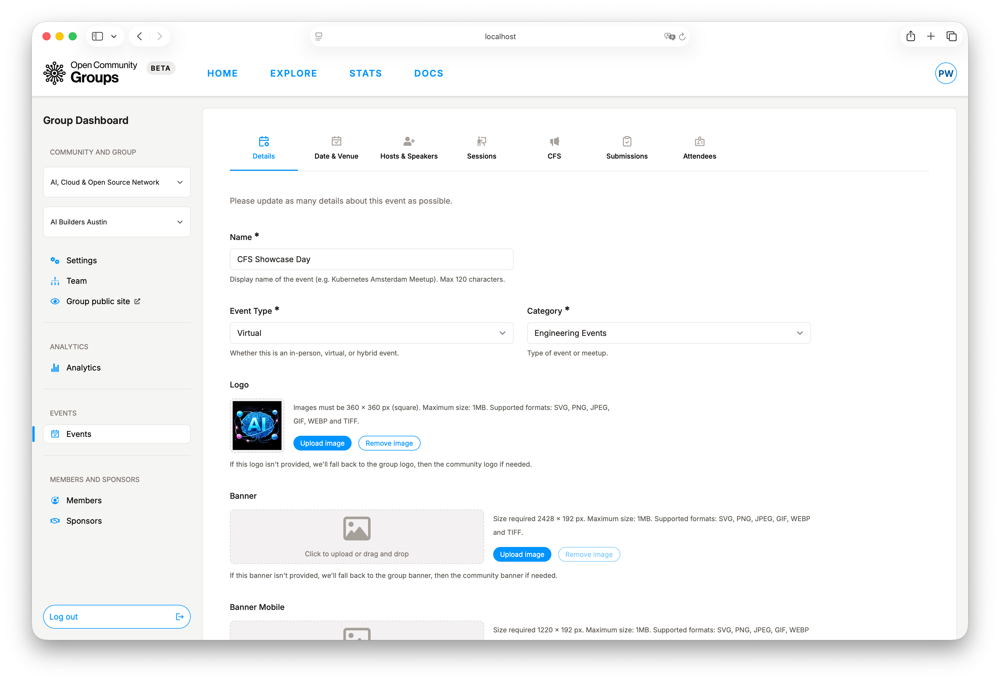

### Date and Venue

This tab controls delivery constraints:

- Timezone, start, and end.
- Venue data for in-person/hybrid events.
- Online event details for virtual/hybrid events.
- 24-hour reminder toggle.

Timezone should be set first, then date/time. That avoids accidental scheduling drift and keeps
CFS windows aligned with the intended audience clock.

?> Set timezone first, then start/end timestamps, to avoid accidental schedule drift.

When `Send Event Reminder` is enabled, OCG sends reminder messages about 24 hours before start
time.

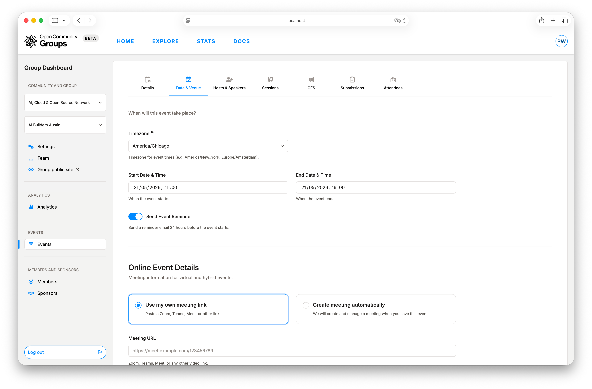

### Hosts and Speakers

In this tab, you manage event-level people and sponsor attribution:

- Add hosts from any user account on the site.
- Add visible speakers/presenters.
- Attach event sponsors from reusable sponsor records.

This is where attendees understand who is running and presenting the program.

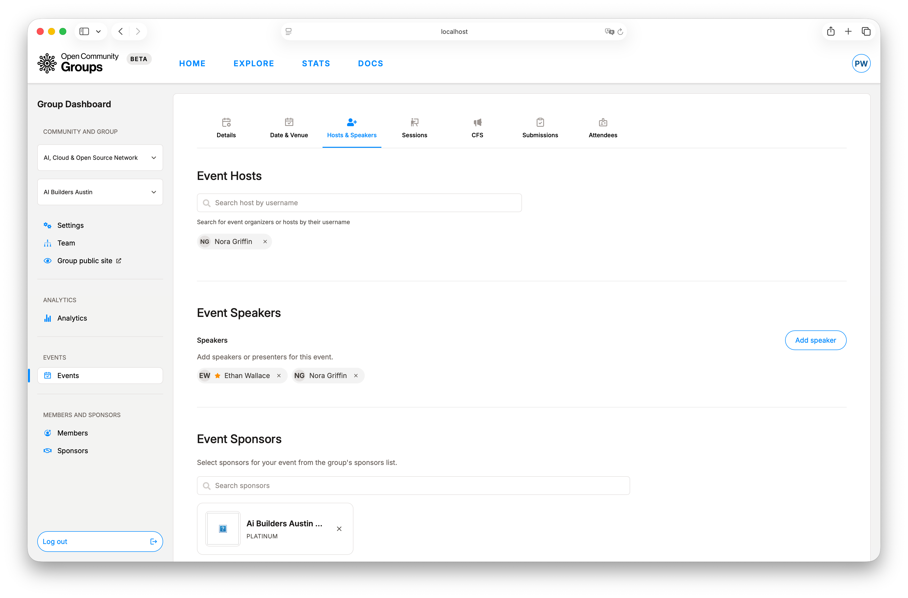

### Sessions

Sessions turns approved content into an actual agenda:

- Create agenda rows with time bounds.
- Keep session times inside event start/end.
- Link approved CFS submissions into the schedule.

This tab is usually most useful once review outcomes are clearer and your schedule is taking
final shape.

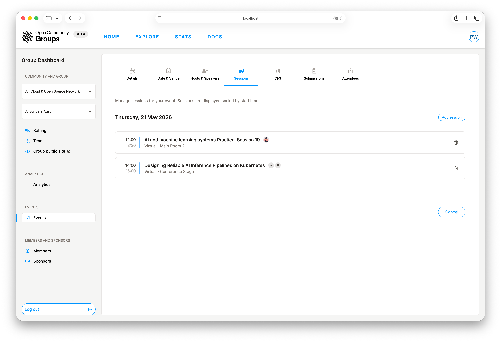

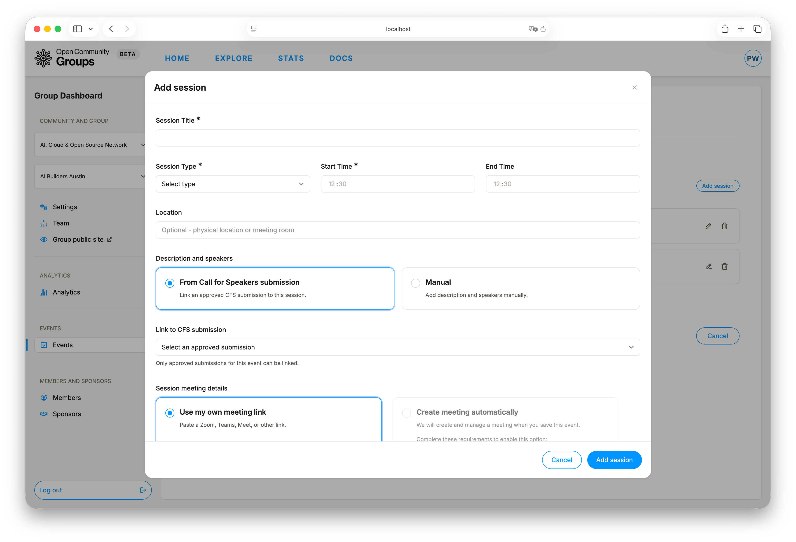

### CFS

This tab configures speaker intake:

- Enable/disable CFS.
- Set open/close timestamps.
- Write CFS description shown on the event page.
- Define optional labels (tracks/topics/themes).

Label model tip: if you edit an existing label name, that rename affects submissions already using
that label.

?> Renaming a label updates existing submissions that already reference that label.

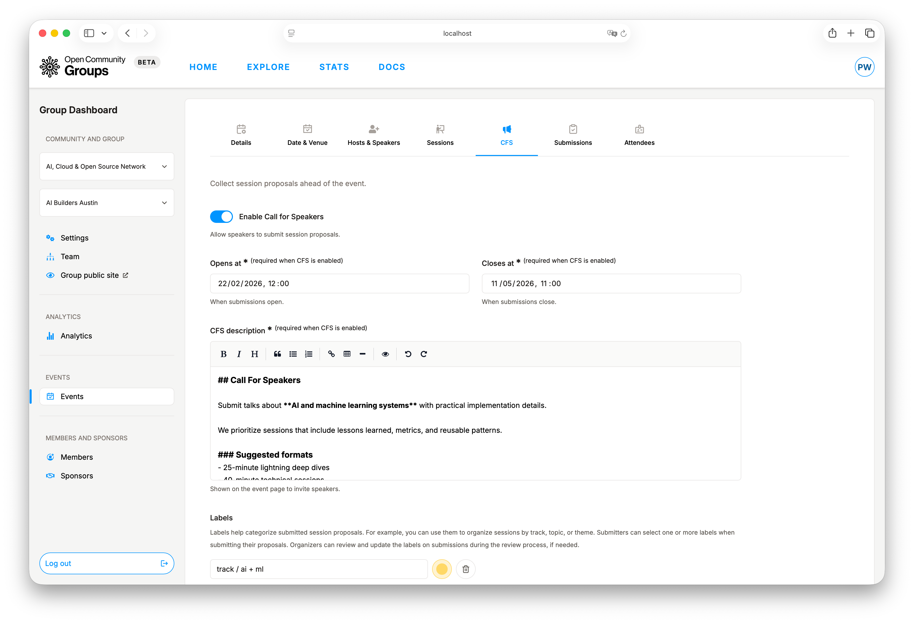

### Attendance and Waitlist Operations

The dashboard now separates confirmed attendees from people still waiting for a seat.

Organizer behavior:

- `Attendees` shows only confirmed attendees.
- `Waitlist` shows people in FIFO order based on when they joined.
- Canceling an event notifies attendees, speakers, and waitlisted users.

Capacity behavior:

- If an attendee leaves and the event has a capacity limit, OCG automatically promotes the oldest
  waitlisted person.
- If you raise event capacity on a published event and seats become available, OCG also promotes from
  the waitlist automatically.
- If you later disable the waitlist, OCG stops accepting new waitlist sign-ups. People who were
  already on the waitlist remain queued and may still be promoted automatically when attendee spots
  open up, for example after a cancellation or a capacity increase.
- If you clear `Capacity` and disable waitlist, OCG treats the event as unlimited-capacity and
  immediately promotes everyone still on the waitlist.
- Promotion notifications are best-effort; the seat change still succeeds even if notification
  enqueue fails.

Member-facing behavior:

- Joining the waitlist sends a waitlist confirmation notification.
- Leaving the waitlist sends a waitlist removal notification.
- Promotion sends a confirmation notification with calendar attachment.

### Submissions

This tab is the reviewer control center:

- Filter by labels.
- Sort by submission time, rating count, or stars.
- Open review modal.
- Update status and add reviewer feedback.

Reviewer-facing statuses are:

- `Not reviewed`
- `Information requested`
- `Approved`
- `Rejected`

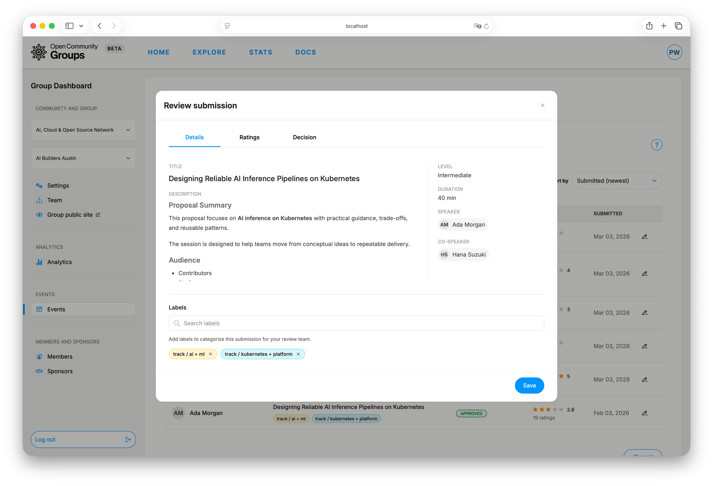

#### Rating submissions

Reviewers can rate each submission on a 1–5 star scale with an optional comment. Ratings
are internal only — speakers never see ratings or rating notes. The review modal shows a
dedicated `Ratings` tab where you can set, update, or clear your rating. Other reviewers'
ratings and comments are visible in the same tab so the team can compare assessments.

The submissions list displays the average rating and total rating count for each entry.
Use the sort options (by stars or rating count) to surface the strongest or most-reviewed
submissions quickly.

When a reviewer update requires notifying the speaker, OCG sends a submission update message.

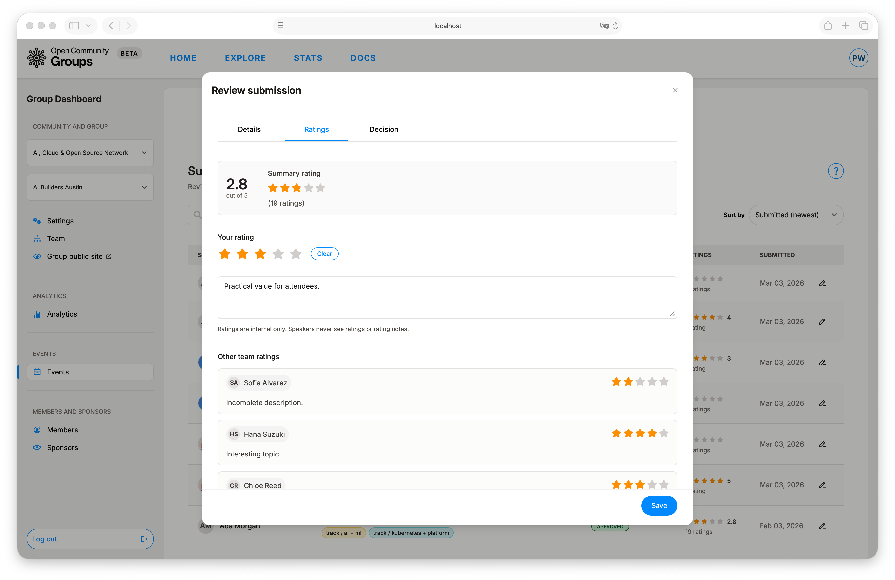

### Attendees

This tab supports delivery-day execution:

- Review attendee list and RSVP timing.
- Run manual check-in.
- Generate check-in QR code for on-site flow.
- Send attendee-wide operational emails.

Manual check-in bypasses attendee self-check-in timing windows, but the person must already be
registered as an attendee and the event must still be published or active.

`Send email` in this tab sends operational updates to attendees.

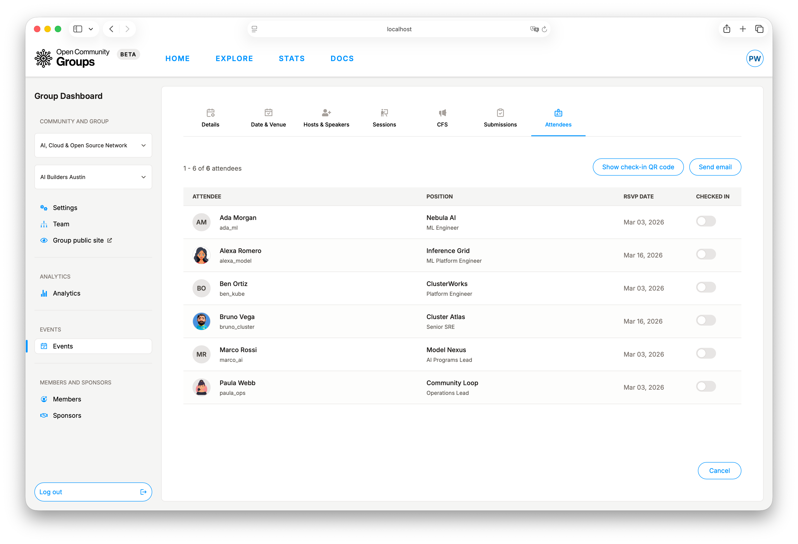

## CFS Workflow (End to End)

CFS spans organizer setup, speaker submission, and review loop. Treat it as one connected system.

1. Organizer configures CFS in the event editor.
2. Organizer publishes the event.
3. Speaker prepares reusable proposals in
   [User Dashboard -> Session proposals](/dashboard/user?tab=session-proposals ':ignore').
4. Speaker submits from the event page CFS modal.
5. Organizer reviews in [Group Dashboard -> Event -> Submissions](/dashboard/group?tab=events ':ignore').
6. Speaker tracks outcomes in
   [User Dashboard -> Submissions](/dashboard/user?tab=submissions ':ignore').
7. Approved submissions are scheduled in `Sessions`.

To submit, these requirements must be met:

!> CFS submission requires a published event, enabled/open CFS, and an eligible proposal.
Duplicate proposal submission to the same event is blocked.

- Event must be published.
- CFS must be enabled.
- CFS window must be open.
- Proposal must be eligible for submission.
- Duplicate submission of the same proposal to the same event is blocked.
- Labels must belong to that event's label set.

Response loop behavior:

- `Information requested` asks speaker for changes before re-review.
- `Resubmit` is used after requested changes are addressed.
- `Withdrawn` is speaker-initiated and typically ends active review.

Every review-side change that should reach the speaker is sent as a submission update message.

For submitter-side perspective, see [User Dashboard Guide](user-dashboard.md).

## Automatic Meeting Creation

Automatic meetings are configured in `Date and Venue -> Online event details`.
You can either use your own manual meeting link or let OCG create/manage a meeting automatically.

How automatic mode works:

- Choose `Create meeting automatically`.
- Select provider (currently `Zoom`).
- Optionally add host emails for coordination.
- Save the event.
- Publish the event to trigger meeting creation.
- Wait for sync; join link/password appear once ready.
- Meetings are automatically ended when the configured end time is reached.

Requirements for automatic mode:

!> Automatic meetings are supported only for `virtual` and `hybrid` events and require valid
schedule/capacity constraints. Manual and automatic meeting modes cannot be used together.

- Event type is `virtual` or `hybrid`.
- Start and end are set, with end after start.
- Duration is within provider limits (5 to 720 minutes).
- Event capacity is set.
- Capacity does not exceed configured provider participant limit.
- Manual meeting links are not used at the same time.

Important limitations and behavior:

!> Switching meeting modes can replace or remove meeting details.
Constraint violations can disable automatic mode until fixed.

- In-person events cannot use automatic meetings.
- Due to current technical limitations, host controls are not available in
  automatically created Zoom meetings.
- Switching automatic to manual can remove auto-created meeting details.
- Switching manual to automatic can replace existing manual links.
- Schedule or type changes can disable automatic mode if constraints are no longer met.
- If sync fails, meeting errors surface in the editor until resolved.
- In deployments without automatic-meeting support, only manual meeting URL fields are available.

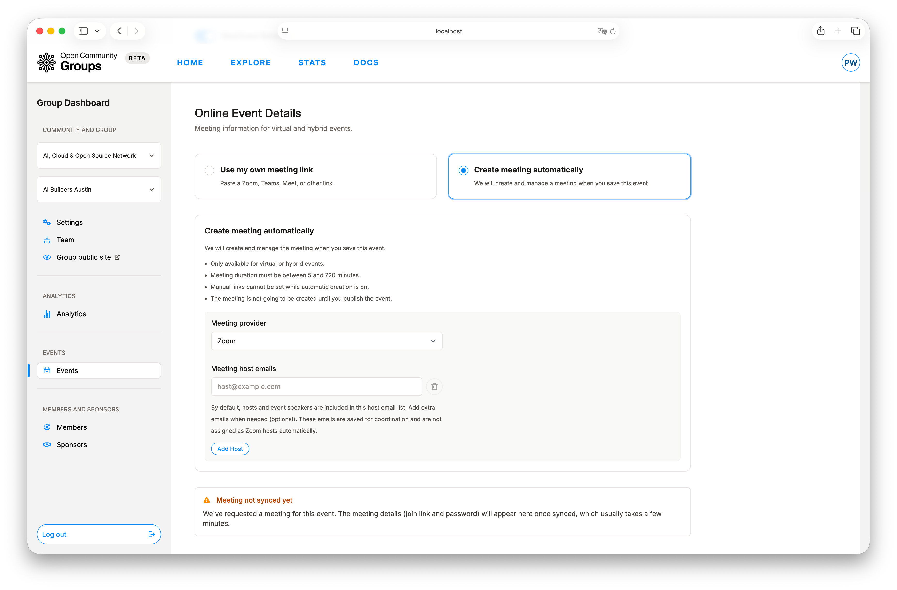

## Publish, Unpublish, Cancel, Delete

These actions serve different intents:

- `Publish`: make event publicly available.
- `Unpublish`: hide event without canceling it.
- `Cancel`: mark event as not proceeding.
- `Delete`: permanently remove from normal operations.

Message behavior:

!> `Publish` and `Cancel` can notify large participant sets.
`Unpublish` and `Delete` do not send broad attendee updates in this flow.

- `Publish` on a future unpublished event can notify group members/team members and listed
  speakers.
- `Cancel` on a future published event notifies attendees, speakers, and waitlisted users.
- Rescheduling a future published event can notify attendees and speakers when the start or end
  time changes by at least 15 minutes. Waitlisted users are not included in reschedule notices.
- `Unpublish` and `Delete` do not send broad attendee updates in this flow.

Automatic-meeting lifecycle in these actions:

- `Publish` triggers creation/sync for configured automatic meetings (event and session meetings).
- `Unpublish`, `Cancel`, and `Delete` trigger removal/sync for configured automatic meetings.

Use the least destructive action that matches your operational goal.

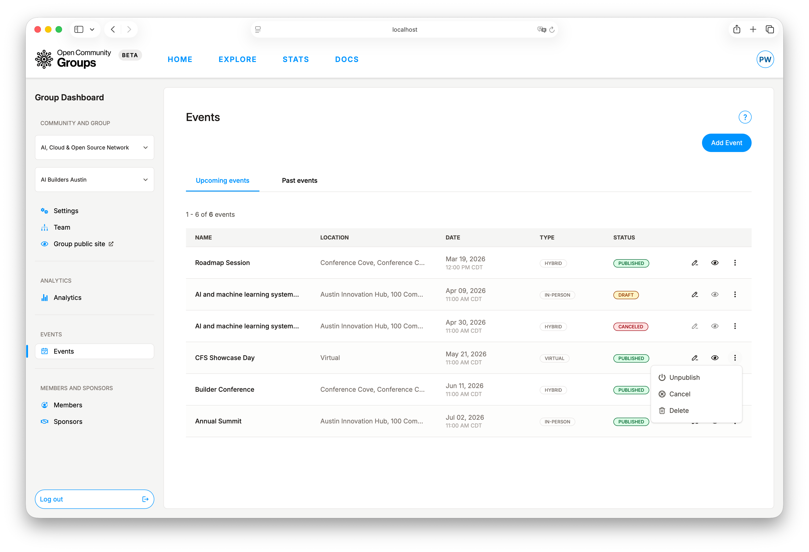

## Public Event Result

The public event page is the delivery surface of all organizer decisions: RSVP controls, logistics,
CFS visibility, and final agenda experience. You can reach it through [Explore](/explore ':ignore').

For attendee/member perspective, see [Public Site Guide](public-site.md).

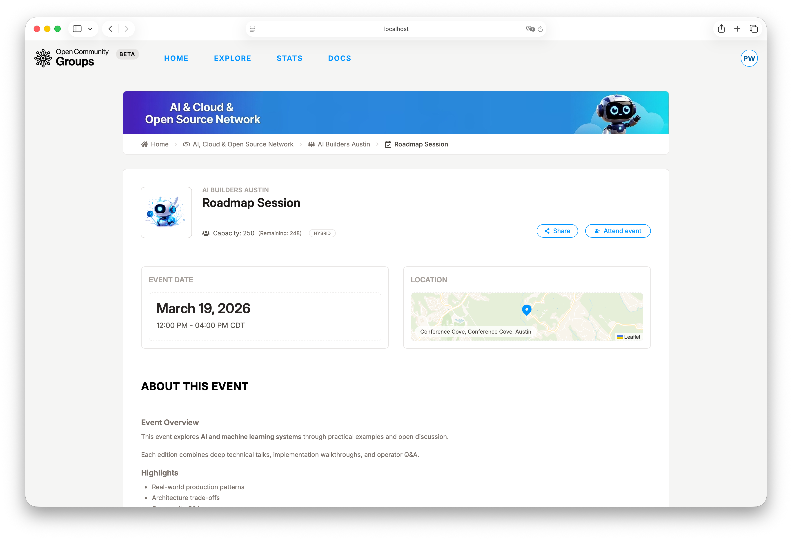

## Event-Day Checklist

?> Run this checklist shortly before start time to catch delivery issues early.

1. Confirm attendee table loads in the `Attendees` tab.
2. Open QR flow and validate the check-in URL.
3. Test one manual check-in path.
4. Prepare attendee email template for urgent updates.
5. Re-verify schedule and meeting links before start.
