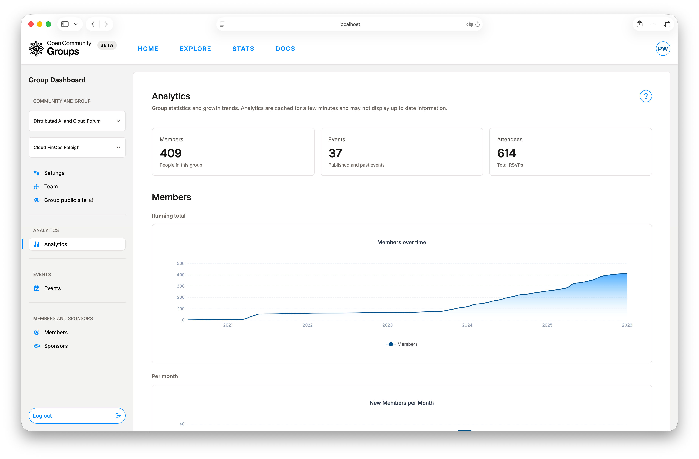
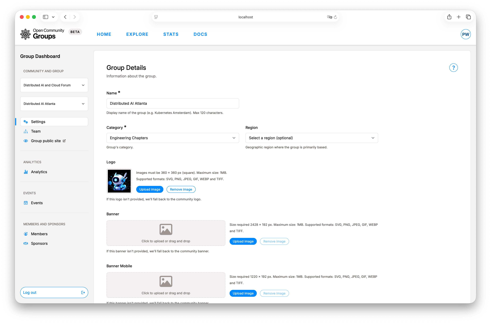
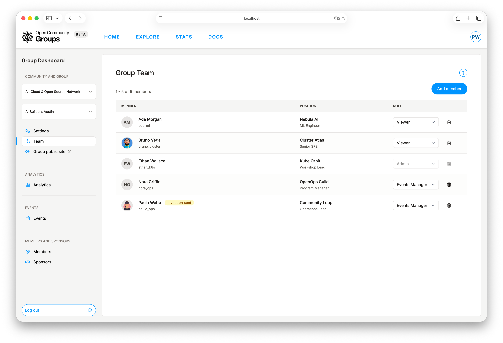
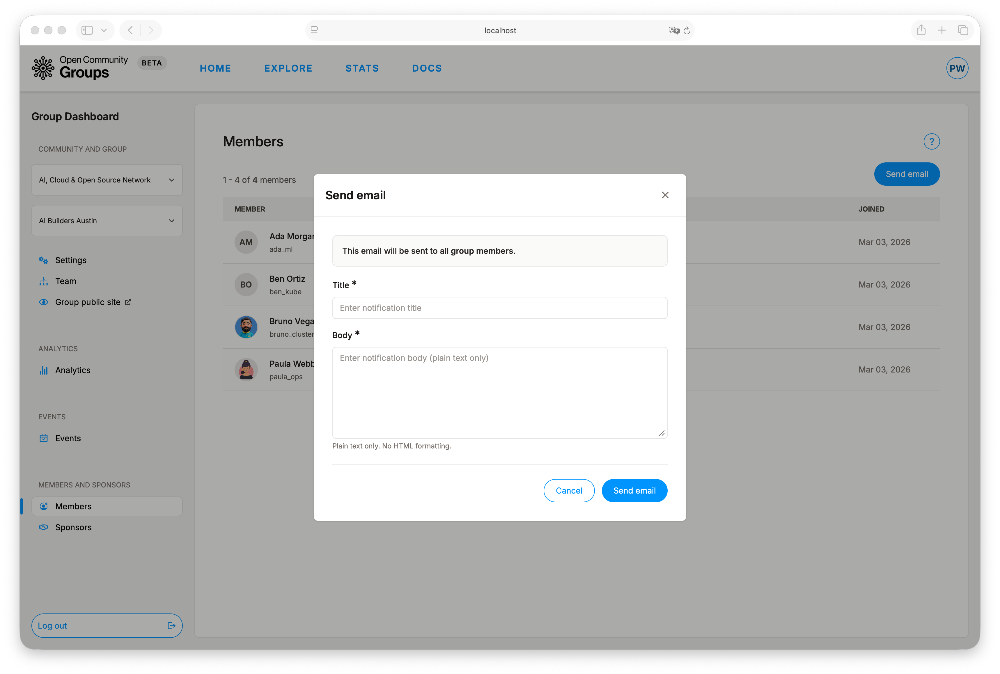
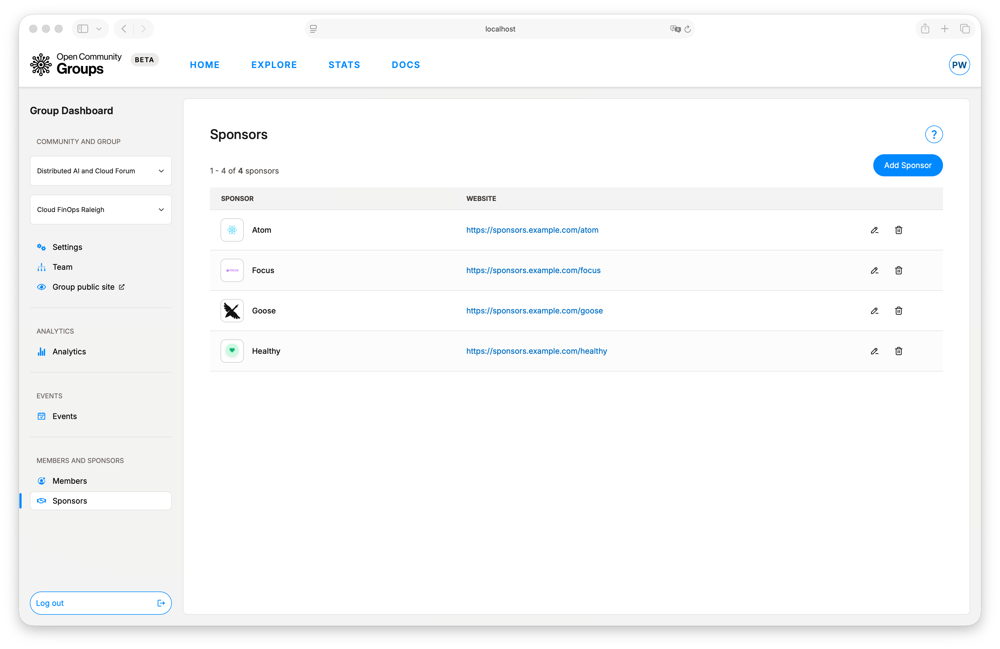
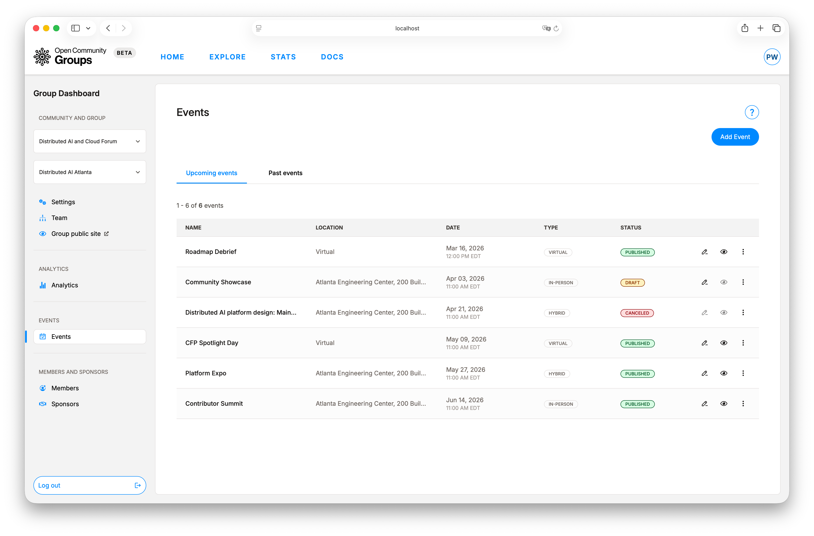
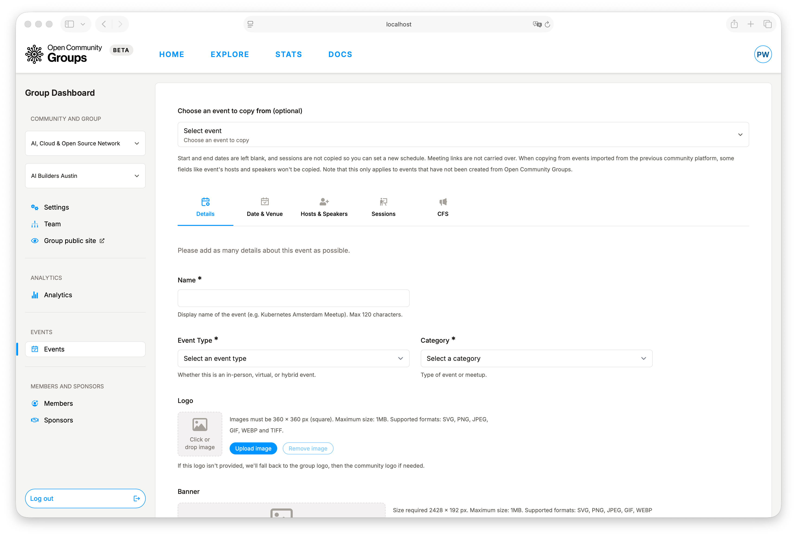

# Group Dashboard Guide

Use the Group Dashboard for execution-level operations. This is where organizers run the actual
program: events, team coordination, member communication, and sponsor management.

If you are still selecting the right workspace, read
[Choose Your Dashboard](../getting-started/choose-dashboard.md).

Path: [`/dashboard/group`](/dashboard/group ':ignore')

**Sections:**

- [What This Dashboard Owns](#what-this-dashboard-owns)
- [Access and Context](#access-and-context)
- [Settings: Group Identity](#settings-group-identity)
- [Team: Organizer Capacity](#team-organizer-capacity)
- [Analytics: Delivery Health](#analytics-delivery-health)
- [Members: Communication](#members-communication)
- [Sponsors: Reusable Profiles](#sponsors-reusable-profiles)
- [Events: Operations Hub](#events-operations-hub)

## What This Dashboard Owns

At community level, you define structure. At group level, you deliver outcomes.

Main areas:

- [`Settings`](/dashboard/group?tab=settings ':ignore'): group identity and public profile quality.
- [`Team`](/dashboard/group?tab=team ':ignore'): organizer membership and roles.
- [`Analytics`](/dashboard/group?tab=analytics ':ignore'): group-level growth trends.
- [`Events`](/dashboard/group?tab=events ':ignore'): full event lifecycle operations.
- [`Members`](/dashboard/group?tab=members ':ignore'): membership view and group-wide communication.
- [`Sponsors`](/dashboard/group?tab=sponsors ':ignore'): reusable sponsor records for event use.

## Access and Context

To operate here, you need:

1. Logged-in session.
2. Group-team membership.
3. Selected community and group context.

If the right community or group is not selected yet, some actions stay unavailable until you pick
them.

## Settings: Group Identity

Use `Settings` to maintain the information people rely on before joining or attending.

You can manage:

- Name, category, and descriptions.
- Branding assets.
- Location search and map coordinates.
- Social links.
- Optional tags, photo gallery, and extra links.

Brand inheritance model in this scope:

- If a group logo is not set, OCG falls back to the community logo.
- If a group banner or mobile banner is not set, OCG falls back to the community banner.

Field requirements and limits are shown inline in the settings form while editing.

## Team: Organizer Capacity

`Team` supports invitation-driven organizer management with role updates for existing members.

Important protection:

- The last accepted team member cannot be removed.

This protects continuity for critical event operations and approvals.

!> The last accepted group team member cannot be removed.
Add another accepted team member first, then retry.

When you add a group team member, OCG sends an invitation with a link to
[`User Dashboard -> Invitations`](/dashboard/user?tab=invitations ':ignore').

Invitation acceptance and dashboard visibility details are covered in
[User Dashboard Guide](user-dashboard.md).

## Analytics: Delivery Health

Group analytics focuses on operational output:

- Members.
- Events.
- Attendees.

Each metric includes running totals and monthly trends, so it is easier to tell whether growth is
steady over time or mainly tied to isolated spikes.

Analytics values can lag briefly due to caching.

## Members: Communication

`Members` provides two practical capabilities:

- Browse member list and join dates.
- Send plain-text email to all group members.

`Send email` reaches both group members and group team members.

## Sponsors: Reusable Profiles

Sponsors are managed once and reused across events, reducing repetitive event setup.

Typical flow:

1. Create sponsor records in [`Sponsors`](/dashboard/group?tab=sponsors ':ignore').
2. Attach sponsors in event editing (`Hosts & Speakers` section).
3. Update sponsor details once to keep future events consistent.

## Events: Operations Hub

Most organizer time is spent in [`Events`](/dashboard/group?tab=events ':ignore'): creating drafts,
publishing, managing CFS, reviewing submissions, and running attendance/check-in flows.

List classification is based on event start time:

- `Upcoming events` includes items whose start time has not yet passed.
- `Past events` includes items whose start time has already passed.

Starting from [`Add Event`](/dashboard/group/events/add ':ignore') gives organizers a structured editor with
tabbed sections that map directly to delivery needs (details, schedule, roles, sessions, CFS,
attendees).

For complete mechanics, continue to:

- [Event Operations](event-operations.md)

To understand how attendees experience the published result, see
[Public Site Guide](public-site.md).
