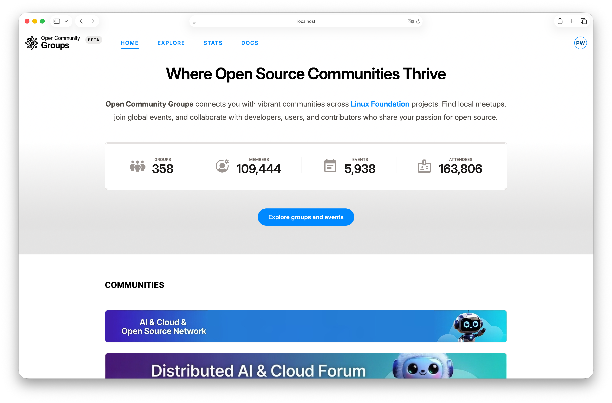

# Public Site Guide

The public site is the participation layer of OCG. It is where members discover communities,
choose groups, RSVP to events, check in, and (when enabled) submit talks to Call for Speakers.

If you are not sure where to start, start here.

If you prefer a faster task-oriented run-through first, use
[Quickstart](../getting-started/quickstart.md).

**Sections:**

- [Understand the Core Pages](#understand-the-core-pages)
- [Discover Quickly in Explore](#discover-quickly-in-explore)
- [Join Groups Intentionally](#join-groups-intentionally)
- [RSVP and Attend Events](#rsvp-and-attend-events)
- [Check In on Event Day](#check-in-on-event-day)
- [Submit to Call for Speakers (CFS)](#submit-to-call-for-speakers-cfs)
- [Use Stats for Platform Context](#use-stats-for-platform-context)
- [Recommended Member Flow](#recommended-member-flow)

## Understand the Core Pages

| Page           | Path                                                 | Why it matters                                                   |
| -------------- | ---------------------------------------------------- | ---------------------------------------------------------------- |
| Home           | [`/`](/ ':ignore')                                   | Platform overview, featured communities, curated upcoming events |
| Explore        | [`/explore`](/explore ':ignore')                     | Search and filter events or groups with multiple views           |
| Stats          | [`/stats`](/stats ':ignore')                         | Platform-level growth and trend visibility                       |
| Community page | `/{community}`                                       | Community identity, activity, and top-level context              |
| Group page     | `/{community}/group/{group_slug}`                    | Membership entry point and group-specific event stream           |
| Event page     | `/{community}/group/{group_slug}/event/{event_slug}` | RSVP, schedule, CFS, and delivery details                        |
| Check-in page  | `/{community}/check-in/{event_id}`                   | Event-day attendance confirmation                                |

## Discover Quickly in Explore

[`Explore`](/explore ':ignore') is designed to help you move from "too many options" to a confident choice.

For events, begin broad and narrow in this order: community, type, category, and date range.
Keeping this order avoids over-filtering too early.

Three view modes are available for both events and groups:

- `List` is the default. Use it for scanning titles, dates, and descriptions linearly.
- `Calendar` shows events on a time grid. It is the fastest way to evaluate conflicts,
  clusters, and quiet periods.
- `Map` plots items geographically with interactive popovers. Use it when location matters
  — for example, finding nearby groups or in-person events in a specific area.

## Join Groups Intentionally

Group membership is your durable connection point. Events come and go, but groups define the
long-term working community.

On the group page, `Join group` adds you as a member. If you later step back, `Leave group`
reverses that state.

Behavior details:

- Logged-out users are prompted to sign in with Linux Foundation SSO.
- Membership state is loaded dynamically after page load.
- Successful join sends a welcome notification (`group-welcome`).

## RSVP and Attend Events

The event page is the source of truth for event delivery. Use it for RSVP, logistics, links,
and speaker-program status.

Click `Attend event` to RSVP. If the event is virtual/hybrid and meeting access is configured,
attendees can see `Join meeting` when the event is live.

Behavior details:

- Attendance state is loaded dynamically after page load.
- RSVP actions are available only before the event start time.
- Canceling RSVP is immediate through `Cancel attendance`.
- Successful RSVP sends an attendee welcome notification (`event-welcome`) with a calendar file.

## Check In on Event Day

Check-in is designed to validate real attendance, so timing and eligibility are enforced.

Window rules:

- Opens 2 hours before start time.
- Closes at the end of the event day.
- For multi-day events, closes at the end of the last day.

You cannot check in if:

- You are not an attendee.
- The event is not published or active.
- The check-in window is closed.

## Submit to Call for Speakers (CFS)

The CFS flow intentionally spans two places:

1. Create reusable proposals in
   [`User Dashboard -> Session proposals`](/dashboard/user?tab=session-proposals ':ignore').
2. Submit those proposals from event pages where CFS is open.

This split keeps your proposal content reusable while preserving per-event submission context
(status, reviewer feedback, labels, and outcomes).

Track progress in [`User Dashboard -> Submissions`](/dashboard/user?tab=submissions ':ignore').

For full speaker workflow detail, continue with
[User Dashboard Guide](user-dashboard.md). For organizer-side review and event lifecycle controls,
see [Event Operations](event-operations.md).

## Use Stats for Platform Context

[`Stats`](/stats ':ignore') helps organizers and contributors understand momentum at a glance: groups,
members, events, and attendees over time.

## Recommended Member Flow

1. Discover in [`Explore`](/explore ':ignore').
2. Join one or more groups.
3. RSVP to events.
4. Check in on event day.
5. Use CFS features when you are ready to submit talks.

When you transition into organizer responsibilities, use
[Choose Your Dashboard](../getting-started/choose-dashboard.md).
