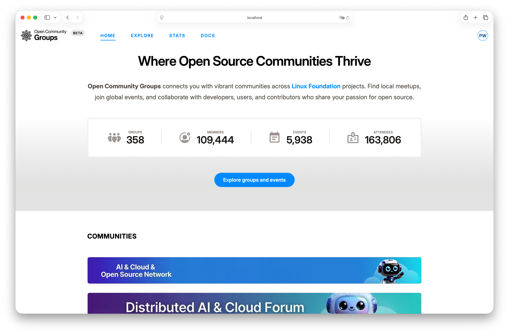
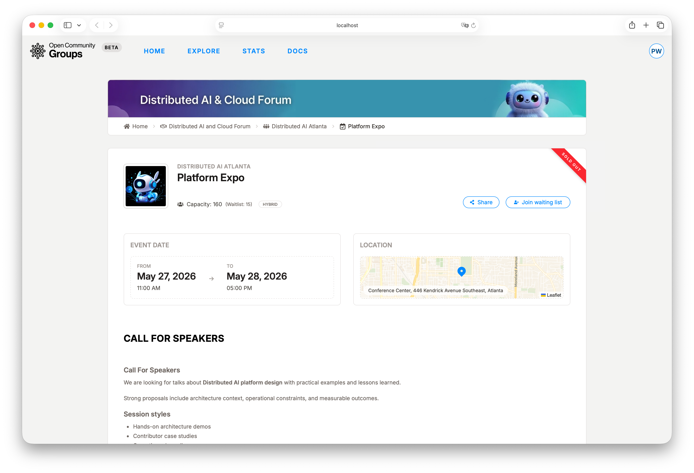
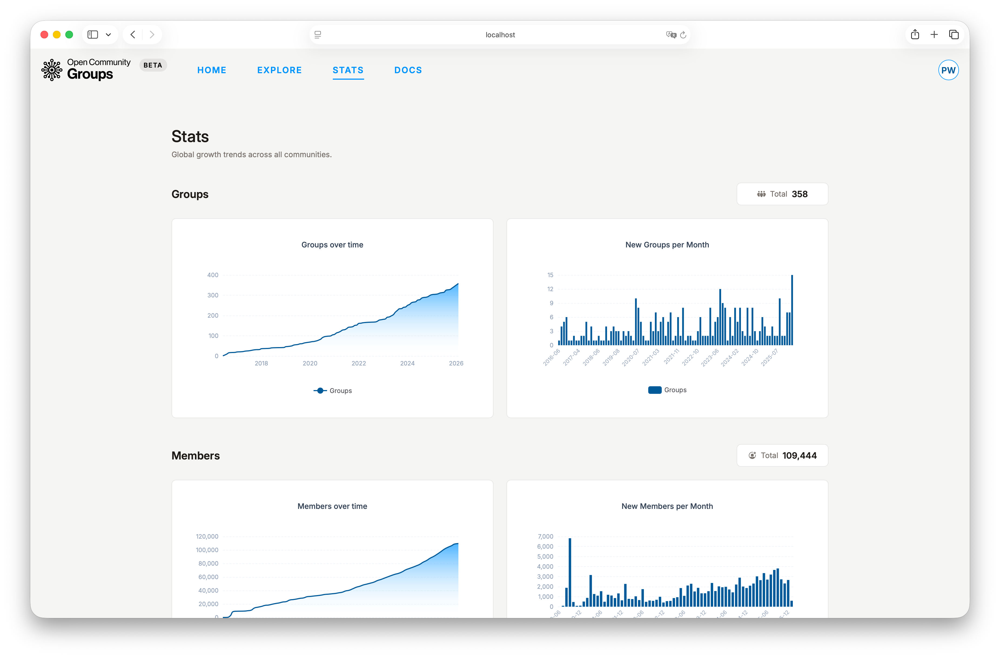

<!-- markdownlint-disable MD013 -->

# Public Site Guide

The public site is where people discover communities, join groups, RSVP to
events, and, when enabled, submit talks to Call for Speakers. If you
are not sure where to start, this is the best place to begin.

If you prefer a faster task-oriented run-through first, use
[Quickstart](../getting-started/quickstart.md).

**Sections:**

- [Understand the Core Pages](#understand-the-core-pages)
- [Discover Quickly in Explore](#discover-quickly-in-explore)
- [Join Groups](#join-groups)
- [Get Tickets, RSVP, and Attend Events](#get-tickets-rsvp-and-attend-events)
- [Check In on Event Day](#check-in-on-event-day)
- [Submit to Call for Speakers (CFS)](#submit-to-call-for-speakers-cfs)
- [Use Stats for Platform Context](#use-stats-for-platform-context)
- [Recommended Member Flow](#recommended-member-flow)

## Understand the Core Pages

| Page           | Path                                                 | Why it matters                                                   |
| -------------- | ---------------------------------------------------- | ---------------------------------------------------------------- |
| Home           | [/](/ ':ignore')                                     | Platform overview, featured communities, curated upcoming events |
| Explore        | [/explore](/explore ':ignore')                       | Search and filter events or groups with multiple views           |
| Stats          | [/stats](/stats ':ignore')                           | Platform-level growth and trend visibility                       |
| Community page | `/{community}`                                       | Community identity, activity, and top-level context              |
| Group page     | `/{community}/group/{group_slug}`                    | Membership entry point and group-specific event stream           |
| Event page     | `/{community}/group/{group_slug}/event/{event_slug}` | RSVP, schedule, CFS, and delivery details                        |

## Discover Quickly in Explore

[Explore](/explore ':ignore') is designed to help you move from
"too many options" to a confident choice.

For events, begin broad and narrow in this order: community, type, category,
and date range. Keeping this order avoids over-filtering too early.

?> Start with community, then add type, category, and date range only if you
need to narrow results further.

Explore gives you multiple view styles, and the available options depend on
what you are browsing: events offer `List` and `Calendar` views, while groups
offer `List` and `Map`.

As a quick guide, `List` helps when you want to scan titles, dates, and
descriptions quickly; `Calendar` helps when you are planning around time
conflicts and busy periods; and `Map` helps when place matters, like finding
nearby groups.

## Join Groups

Joining a group is how you stay connected to a community over time. Events
come and go, but groups are where ongoing participation happens.

On the group page, `Join group` adds you as a member. If you are logged out,
you are prompted to sign in with Linux Foundation SSO first, and the join
button may take a moment to update after the page loads. Once you join, OCG
sends a welcome message with a link back to the group page. If you later step
back, `Leave group` removes you from the group.

Some group pages also show hierarchy sections: `Parent group` links from a
subgroup back to its active parent, and `Subgroups` links from a parent group
to its active subgroups.

When a group has active subgroups, its group page event stream includes events from the group and
those active subgroups. This affects the next-event panel, upcoming events, past events, and the
`See all events` Explore links from that group page. Public member counts and Explore group search
do not aggregate subgroup data.

## Get Tickets, RSVP, and Attend Events

The event page is the best place to check event details, enrollment options,
logistics, links, and speaker-program status.

Every event uses admission tiers. When an event has one free public tier, OCG
keeps the experience simple and shows `Attend event`. Other configurations use
one of these states:

- `Get free ticket` completes an intrinsically free ticket inside OCG.
- `Get ticket` opens public ticket selection and starts hosted checkout only
  when the final price is positive.
- `Request ticket` submits an approval request for a selectable public tier.
- `Tickets are available by invitation only` means public enrollment is not
  available.
- `Paid tickets temporarily unavailable` means the event has paid tickets but
  none can be selected right now, for example because no ticket price window
  is currently open, ticket tiers are disabled, or tickets are sold out
  without a waiting list.

On the public event page, `Capacity` and `Remaining` describe seats in active public ticket tiers
with a current price. Invitation-only seats are excluded. `Remaining` accounts for confirmed
purchases and unexpired admission offers and checkout holds; pending approval requests do not
reserve seats.

Registration questions appear at the stage where the answers are needed:
before a direct checkout, with an approval request, or when an organizer or
waitlist offer is claimed. Joining a ticket waiting list does not collect
answers.

A few details shape event enrollment:

- The action may take a moment to update after the page loads.
- Public enrollment is available only before the event start time.
- If organizers configured a registration window, the event page shows when registration opens or
  closes. Attending, starting ticket checkout, ticket requests, waitlist joining, and
  registration-question answers are disabled outside that window. If you already have an active
  ticket hold, you can continue checkout and required registration questions until the hold expires.
- Canceling RSVP is immediate through `Cancel attendance`.
- Free ticket attendees can also cancel attendance immediately.
- Paid attendees request a refund instead of leaving directly.
- When an organizer rejects a refund request, the event page shows `Refund rejected` and the
  organizer's reason. If an older malformed rejection has no reason, the generic rejected state is
  still shown.
- After attendance is confirmed, OCG sends a confirmation message with a
  calendar file attached.
- If the event is virtual or hybrid and meeting access is configured,
  attendees can see `Join meeting` when the event is live.

When an event has a capacity limit, the button behavior depends on organizer settings:

- A full RSVP event can expose one event-level waiting list.
- Each sold-out public ticket tier can expose its own `Join waiting list`
  action.
- One user can join only one ticket-tier waiting list for the event.
- When the waitlist is enabled and already has people queued, the event page can show a public
  `(Waitlist: N)` count next to capacity.
- Logged-out visitors are asked to sign in before they can RSVP or join the waitlist.
- If you later leave the waitlist, that change is immediate.
- RSVP waitlist promotion confirms attendance or requests registration
  answers. Ticket waitlist promotion creates a time-limited offer that must be
  claimed from the user dashboard.
- Ticket offers show the assigned tier, displayed price, and exact deadline.
  The price is fixed on first claim, and later checkout retries keep that
  snapshot.
- Declining a ticket waitlist offer or letting it expire releases the seat and
  removes that queue position. You are not automatically rejoined.
- Organizer invitations can still be completed outside the public registration window.

For approval events, keep these points in mind:

- Pending requests do not reserve seats.
- Public ticket requests keep the selected tier; organizers cannot substitute
  another tier.
- Fully private generic requests require the organizer to assign an active
  invitation-only tier.
- `Request pending` means the request is waiting for review.
- `Request rejected` means organizers declined the request; resubmitting is not available.
- Accepted ticket requests create an offer rather than charging or registering
  the requester automatically.

!> Attendance must be confirmed before event-day check-in is available.

## Check In on Event Day

Open [User Dashboard -> Check-In](/dashboard/user?tab=check-in ':ignore') on
your phone and select the event. OCG displays your personal QR code with your
name and ticket details. Present that code to an organizer, who scans it to
record your arrival.

Only confirmed, current or upcoming events appear. Keep the code private: it
identifies your attendance and is intended to be scanned by event staff.

## Submit to Call for Speakers (CFS)

The CFS flow happens in two places:

1. Create reusable proposals in
   [User Dashboard -> Session proposals](
   /dashboard/user?tab=session-proposals ':ignore').
2. Submit those proposals from event pages where CFS is open.

This lets you reuse proposal content while keeping each event submission
separate, including status, reviewer feedback, labels, and outcomes.

Track progress in
[User Dashboard -> Submissions](/dashboard/user?tab=submissions ':ignore').

For full speaker workflow detail, continue with
[User Dashboard Guide](user-dashboard.md). For organizer-side review and event
lifecycle controls, see [Event Operations](event-operations.md).

## Use Stats for Platform Context

[Stats](/stats ':ignore') helps organizers and contributors understand
momentum at a glance: groups, members, events, and attendees over time.

## Recommended Member Flow

1. Discover in [Explore](/explore ':ignore').
2. Join one or more groups.
3. RSVP to events.
4. Present your personal dashboard QR code on event day.
5. Use CFS features when you are ready to submit talks.

When you transition into organizer responsibilities, use
[Choose Your Dashboard](../getting-started/choose-dashboard.md).
