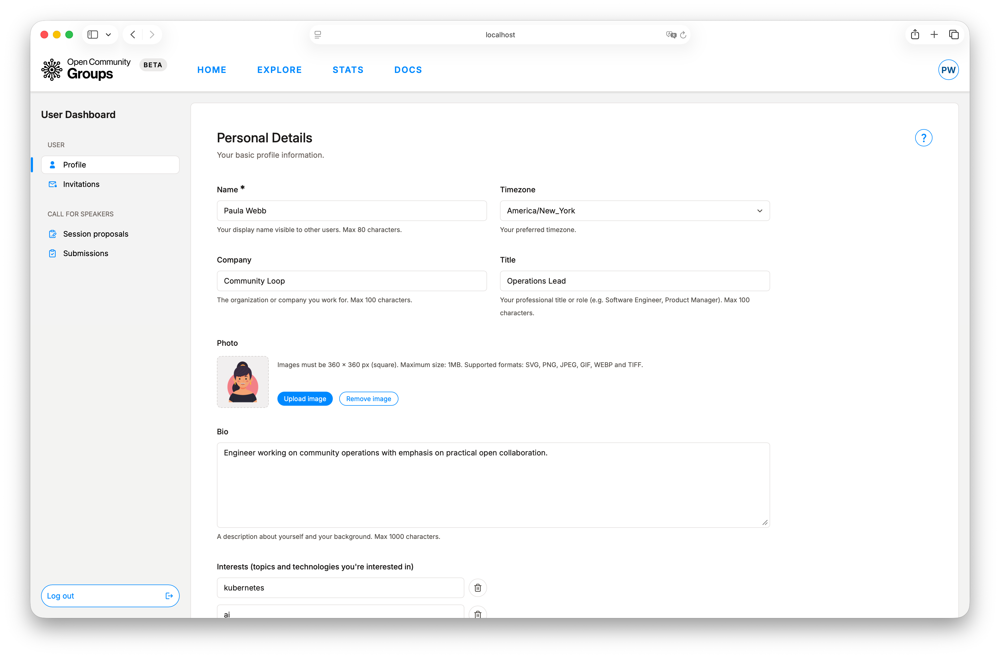
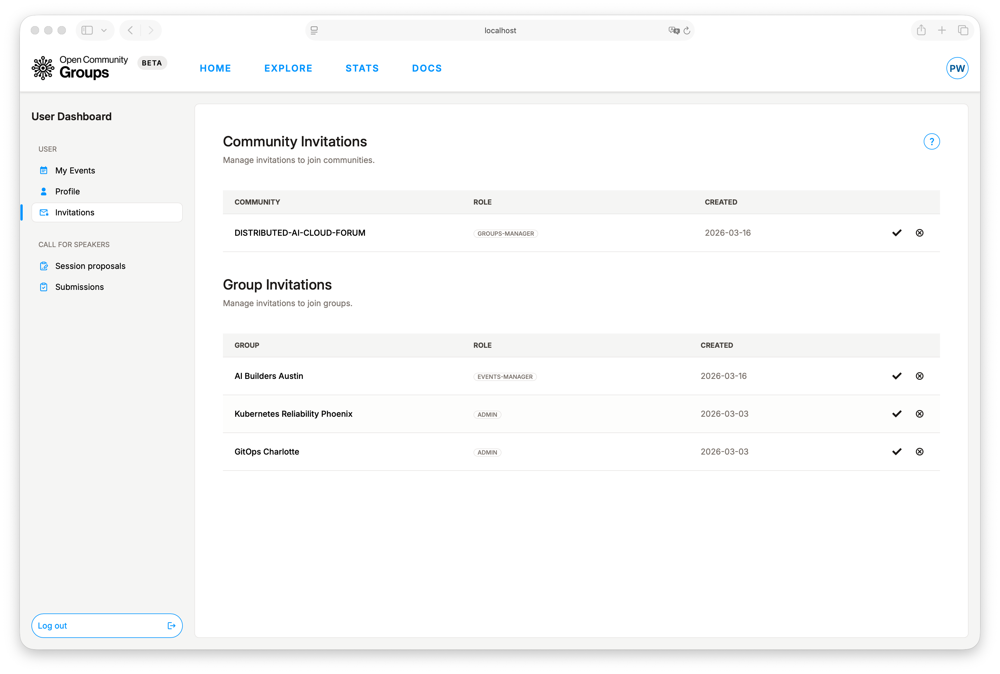
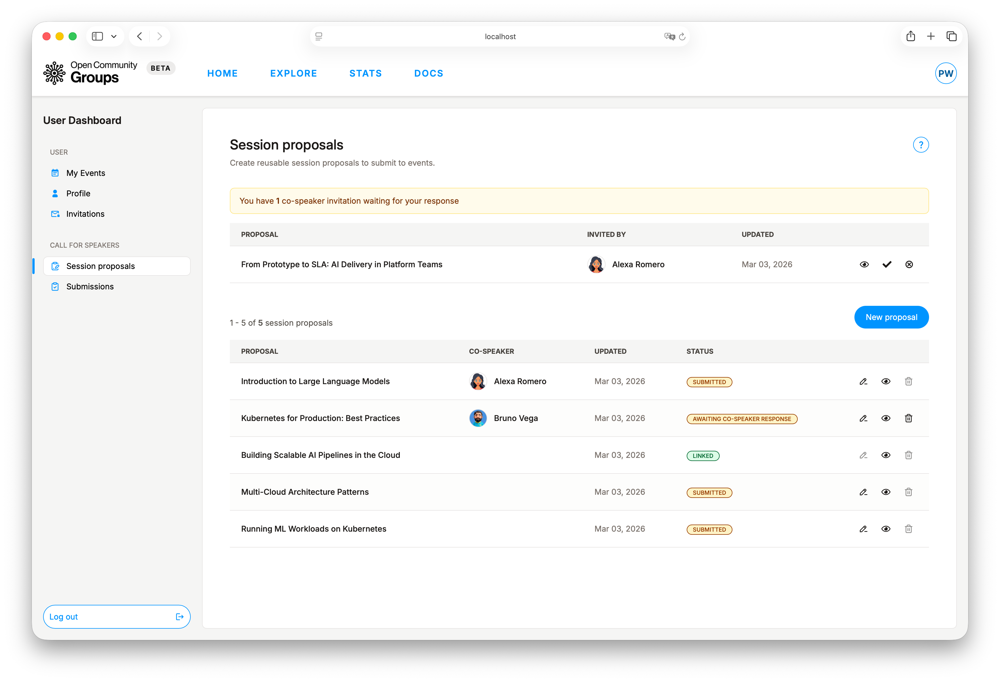
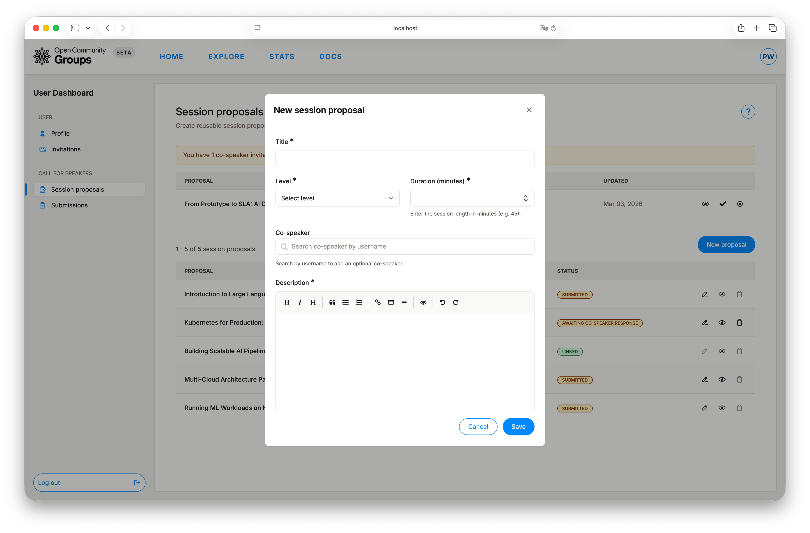
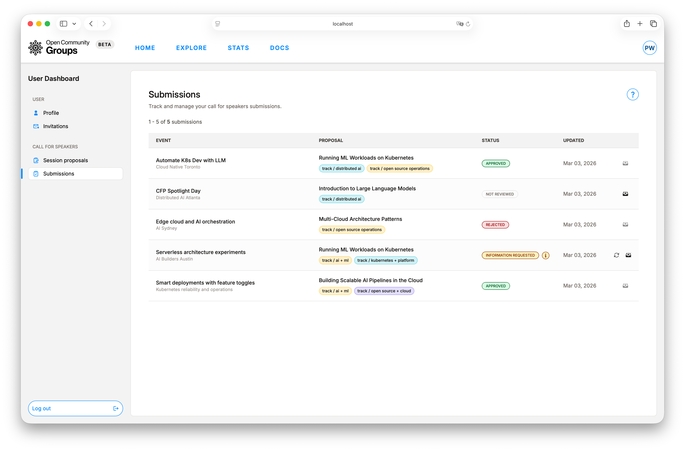

# User Dashboard Guide

Think of the User Dashboard as your home base inside OCG. It brings profile, invitations,
proposal writing, and submission tracking into one place so moving from participant to speaker
feels smooth.

For a fast end-to-end walkthrough first, use
[Quickstart](../getting-started/quickstart.md).

Path: [`/dashboard/user`](/dashboard/user ':ignore')

**Sections:**

- [User Dashboard Structure](#user-dashboard-structure)
- [Profile: Public Identity](#profile-public-identity)
- [Invitations: Unlock Organizer Access](#invitations-unlock-organizer-access)
- [Session Proposals: Reusable Talks](#session-proposals-reusable-talks)
- [Submissions: Track and Respond](#submissions-track-and-respond)
- [Recommended Working Rhythm](#recommended-working-rhythm)

## User Dashboard Structure

The dashboard is organized into four areas:

- [`Profile`](/dashboard/user?tab=account ':ignore')
- [`Invitations`](/dashboard/user?tab=invitations ':ignore')
- [`Session proposals`](/dashboard/user?tab=session-proposals ':ignore')
- [`Submissions`](/dashboard/user?tab=submissions ':ignore')

Each area maps to a specific phase of your lifecycle: identity, access, content creation,
and review outcomes.

## Profile: Public Identity

`Profile` is not just cosmetic. Organizers, co-speakers, and reviewers use this information
when collaborating with you.

You can maintain:

- Personal details: name, timezone, company, title, photo, bio, interests.
- Location: city and country.
- Social links: website, LinkedIn, Bluesky, X, Facebook.

Field requirements and limits are shown inline in the dashboard forms while you edit.

## Invitations: Unlock Organizer Access

When a community or group invites you to help run operations, the invitation appears here.
Accepting an invitation updates your access model and can surface new dashboard options in
your user menu.

Invitation statuses:

- Community and group team invites: `Invitation sent`, accepted, rejected.
- Pending team invites do not grant dashboard access until accepted.

When someone invites you to a team, you receive an in-app and email invitation with a direct path
to accept or decline.

Typical post-accept behavior:

1. Access is granted to the related scope.
2. Pending invitation state clears.
3. A refresh or re-login may be needed before navigation updates.

If organizer dashboards still do not appear, see
[Choose Your Dashboard](../getting-started/choose-dashboard.md) and
[Troubleshooting](../support/troubleshooting.md).

## Session Proposals: Reusable Talks

`Session proposals` is where you maintain reusable speaker assets. This keeps your talk content
consistent while allowing event-level submission decisions later.

Create flow:

1. Click `New proposal`.
2. Complete required fields (`Title`, `Level`, `Duration`, `Description`).
3. Optionally add a co-speaker by username search.
4. Save and reuse the proposal in eligible event CFS flows.

For event-side CFS controls and reviewer operations, see
[Event Operations](event-operations.md).

### Proposal Status Model

Base statuses:

- `Ready for submission`
- `Awaiting co-speaker response`
- `Declined by co-speaker`

Derived badges may also appear:

- `Submitted` (used in one or more event submissions).
- `Linked` (already tied to an approved session).

### When a Proposal Gets Locked

Not all locks are the same. OCG uses two practical lock levels:

> [!IMPORTANT]
> `Linked` is a hard lock.
> Once a proposal is linked to an accepted event session, it can no longer be edited in place.
> `Submitted` is a partial lock.
> You can still improve most proposal content, but delete is blocked and co-speaker changes are
> restricted after submission.

- `Linked` is a hard lock. Once a proposal is linked to an accepted event session, it is treated as
  delivery content and can no longer be edited in place.
- `Submitted` is a partial lock. You can still improve most proposal content, but some operations
  become constrained because the proposal is already in review history:
  - Delete is blocked.
  - Co-speaker changes are restricted after submission.

Status-related submission locks:

- `Awaiting co-speaker response` and `Declined by co-speaker` are not full edit locks, but they do
  block CFS submission eligibility until co-speaker state is resolved.

### Co-Speaker Invitations

If another speaker invites you as co-speaker, OCG shows an in-app alert with actions to view,
accept, or decline. This keeps proposal ownership clear without hidden side effects.

Co-speaker invite statuses appear with your proposal workflow: pending, accepted, or declined.

## Submissions: Track and Respond

Once you submit a proposal from an event page, `Submissions` becomes your control center for
review progress.

Common statuses:

- `Not reviewed`
- `Information requested`
- `Approved`
- `Rejected`
- `Withdrawn`

Action behavior:

- `Resubmit` appears when status is `Information requested`.
- `Withdraw` stays available while the submission is active and not finalized.
- Withdraw is blocked for finalized or linked outcomes.

When organizers change your submission review state, OCG sends an update message with the new
status and any action you need to take.

To understand where submission decisions are made, see
[Event Operations](event-operations.md).

## Recommended Working Rhythm

> [!TIP]
> Keep this cycle active to avoid last-minute blockers around invitations or submission windows.

1. Keep profile current (especially bio, timezone, and links).
2. Clear invitations quickly so role-based access stays accurate.
3. Build reusable proposals before deadlines.
4. Submit to events where CFS is open.
5. Watch `Submissions` and respond fast when information is requested.
