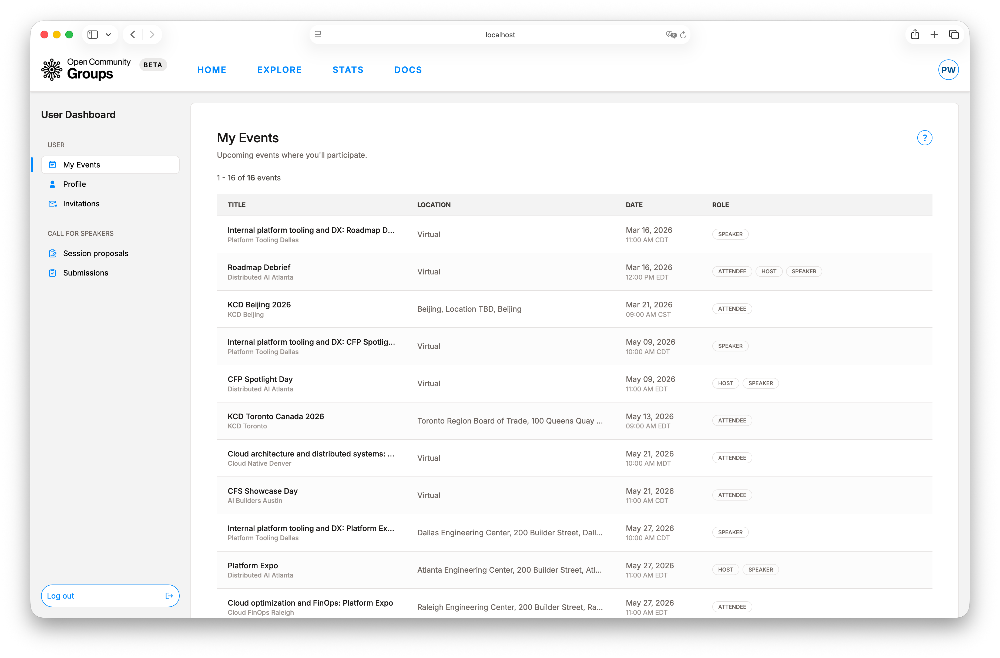
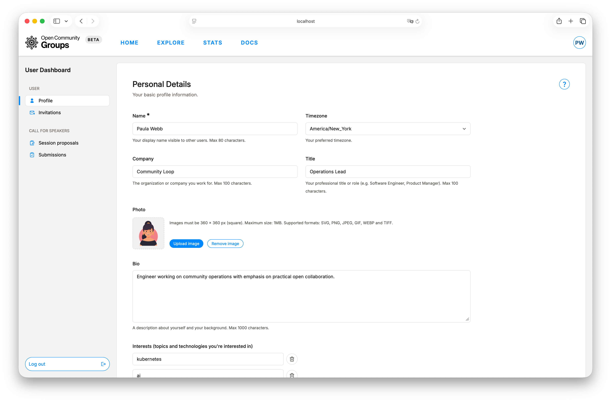
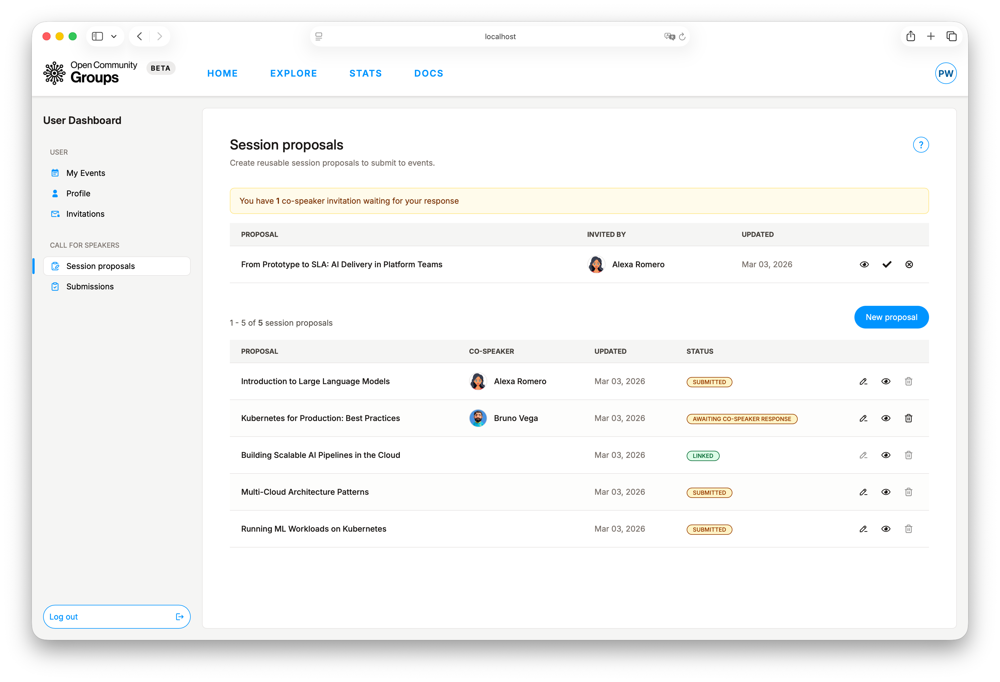
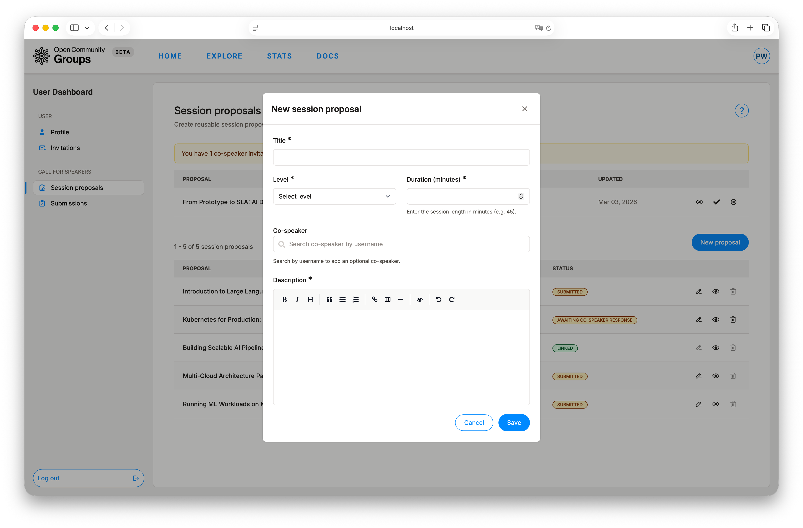
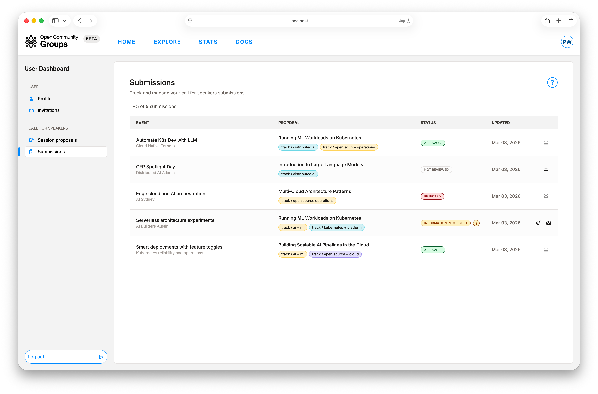

<!-- markdownlint-disable MD013 -->

# User Dashboard Guide

Think of the User Dashboard as your home base inside OCG. It brings upcoming events, profile,
invitations, proposal writing, and submission tracking into one place so moving from participant
to speaker feels smooth.

For a fast end-to-end walkthrough first, use
[Quickstart](../getting-started/quickstart.md).

Path: [/dashboard/user](/dashboard/user ':ignore')

**Sections:**

- [User Dashboard Structure](#user-dashboard-structure)
- [My Events: Upcoming Participation](#my-events-upcoming-participation)
- [Profile: Public Identity](#profile-public-identity)
- [Invitations: Unlock Organizer Access](#invitations-unlock-organizer-access)
- [Session Proposals: Reusable Talks](#session-proposals-reusable-talks)
- [Submissions: Track and Respond](#submissions-track-and-respond)
- [Audit: Logs](#audit-logs)
- [Recommended Working Rhythm](#recommended-working-rhythm)

## User Dashboard Structure

The dashboard is organized into five areas:

- [My Events](/dashboard/user?tab=events ':ignore')
- [Profile](/dashboard/user?tab=account ':ignore')
- [Invitations](/dashboard/user?tab=invitations ':ignore')
- [Session proposals](/dashboard/user?tab=session-proposals ':ignore')
- [Submissions](/dashboard/user?tab=submissions ':ignore')
- [Logs](/dashboard/user?tab=logs ':ignore')

Each area supports a different part of your participation in OCG: events,
profile, access, audit visibility, proposals, and submissions.

## My Events: Upcoming Participation

`My Events` is your personal queue of upcoming events where you already have an active role.

Each row includes:

- Event title with a direct link to the public event page.
- Event location.
- Event date and time.
- Your role in that event (`Attendee`, `Host`, `Speaker`, or multiple roles).

Filtering behavior:

- Includes only upcoming published events.
- Excludes canceled events.
- Excludes events from inactive or deleted groups.

Sorting behavior:

- Ordered by date ascending, so the next event appears first.

## Profile: Public Identity

`Profile` is not just cosmetic. Organizers, co-speakers, and reviewers use this information
when collaborating with you.

You can maintain:

- Personal details: name, timezone, company, title, photo, bio, interests.
- Location: city and country.
- Social links: website, LinkedIn, Bluesky, X, Facebook, GitHub.
- Notification preferences.

Field requirements and limits are shown inline in the dashboard forms while you edit.

Notification preferences:

- `Receive optional notifications` controls broader announcements such as new event
  announcements, event reminders, and custom messages from organizers.
- Turning this off does not disable account, invitation, registration, speaker, refund, waitlist,
  cancellation, or reschedule updates.

## Invitations: Unlock Organizer Access

When a community or group invites you to help run operations, the invitation
appears here. Accepting an invitation updates your access and can add new
dashboard options in your user menu.

Invitation statuses:

- Community and group team invites: Invitation sent, accepted, rejected.
- Pending team invites do not grant dashboard access until accepted.
- Invitation rows include the role that will be assigned on acceptance.

When someone invites you to a team, you receive an in-app and email invitation with a direct path
to accept or decline.

Typical post-accept behavior:

1. Access is granted to the related scope.
2. The assigned community/group role becomes active for permission checks.
3. Pending invitation state clears.
4. A refresh or re-login may be needed before navigation updates.

If organizer dashboards still do not appear, see
[Choose Your Dashboard](../getting-started/choose-dashboard.md) and
[Troubleshooting](../support/troubleshooting.md).

## Session Proposals: Reusable Talks

`Session proposals` is where you manage talk proposals you can reuse across
events. This helps you keep your talk content consistent while submitting to
different events.

Create flow:

1. Click `New proposal`.
2. Complete required fields (`Title`, `Level`, `Duration`, `Description`).
3. Optionally add a co-speaker by username search.
4. Save and reuse the proposal in eligible event CFS flows.

For event-side CFS controls and reviewer operations, see
[Event Operations](event-operations.md).

### Proposal Status Model

Base statuses:

- `Ready for submission`
- `Awaiting co-speaker response`
- `Declined by co-speaker`

Derived badges may also appear:

- `Submitted` (used in one or more event submissions).
- `Linked` (already tied to an approved session).

### When a Proposal Gets Locked

!> `Linked` proposals cannot be edited. `Submitted` proposals can still be
updated, but delete and some co-speaker changes are blocked.

- `Linked` is a hard lock. Once a proposal is linked to an accepted event session, it is treated as
  delivery content and can no longer be edited in place.
- `Submitted` is a partial lock. You can still improve most proposal content, but some operations
  become constrained because the proposal is already in review history:
  - Delete is blocked.
  - Co-speaker changes are restricted after submission.

Status-related submission locks:

- `Awaiting co-speaker response` and `Declined by co-speaker` are not full edit locks, but they do
  block CFS submission eligibility until co-speaker state is resolved.

### Co-Speaker Invitations

If another speaker invites you as co-speaker, OCG shows an in-app alert with actions to view,
accept, or decline. This keeps proposal ownership clear without hidden side effects.

Co-speaker invite statuses appear with your proposal workflow: pending, accepted, or declined.

## Submissions: Track and Respond

Once you submit a proposal from an event page, `Submissions` becomes your control center for
review progress.

Common statuses:

- `Not reviewed`
- `Information requested`
- `Approved`
- `Rejected`
- `Withdrawn`

Action behavior:

- `Resubmit` appears when status is `Information requested`.
- `Withdraw` stays available while the submission is active and not finalized.
- Withdraw is blocked for finalized or linked outcomes.

When organizers change your submission review state, OCG sends an update message with the new
status and any action you need to take.

To understand where submission decisions are made, see
[Event Operations](event-operations.md).

## Audit: Logs

`AUDIT -> Logs` is the last section in the left dashboard menu. It provides an actor-based audit
trail for actions you performed from the user dashboard and account settings.

Coverage in this view includes:

- Invitation accept and reject actions.
- Session proposal create, update, delete, and co-speaker invitation decisions.
- Submission resubmits and withdrawals.
- Account profile and password updates.

Table behavior:

- Rows are ordered by newest first by default.
- You can filter by `Action` and date range.
- You can switch ordering between newest first and oldest first.
- Pagination keeps the active filters applied.
- `Details` opens a popover when an audit row has extra metadata.

Scope note:

- This screen shows actions performed by the signed-in user.
- It does not try to list unrelated actions performed by other people against your account.

## Recommended Working Rhythm

?> Review this list regularly so invitations and submission deadlines do not
catch you by surprise.

1. Keep profile current (especially bio, timezone, and links).
2. Track `My Events` to stay ahead of upcoming commitments.
3. Clear invitations quickly so role-based access stays accurate.
4. Build reusable proposals before deadlines.
5. Submit to events where CFS is open.
6. Watch `Submissions` and respond fast when information is requested.
