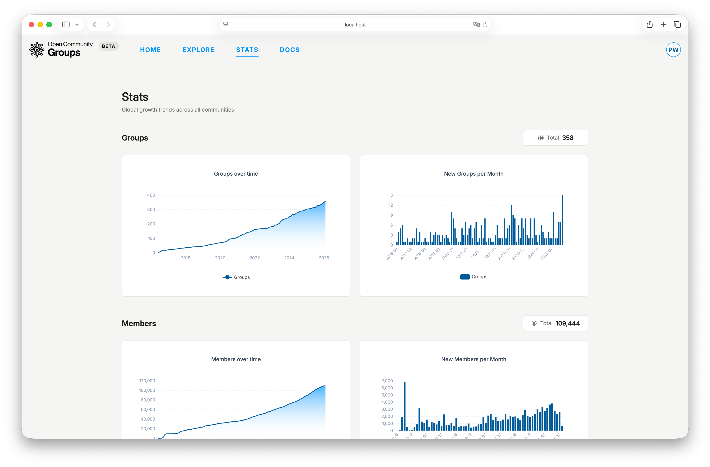

<!-- markdownlint-disable MD013 -->

# Frequently Asked Questions

## Is OCG Mobile Friendly?

Public pages are usable on mobile. Dashboards are currently desktop-only.

## Where Do I Submit a Speaker Proposal?

Create proposals in
[User Dashboard -> Session proposals](/dashboard/user?tab=session-proposals ':ignore'), then
submit from each event's public CFS modal.

## Why Is My Proposal Missing in CFS Modal?

Likely causes:

- Proposal is not eligible for submission status.
- Proposal was already submitted to this event.
- You are logged in with a different account.

## Can I Undo a Submission?

You can withdraw while review is still active. After a final decision, withdraw is no longer
available.

## Can I Check In Without RSVP?

No. Only attendees can check in.

## Can I Use Automatic Meeting Creation on In-Person Events?

No. Automatic meeting requests are allowed only for `virtual` and `hybrid` events.

## Are Automatically Created Meetings Ended Automatically?

Yes. Meetings created automatically are also ended automatically when the configured end time is
reached.

## Why Are Host Controls Missing in Automatically Created Zoom Meetings?

At the moment, host controls are not available in automatically created Zoom meetings due to some
technical limitations.

## Where Can I See Platform-Wide Growth Trends?

Use the public [Stats](/stats ':ignore') page.

