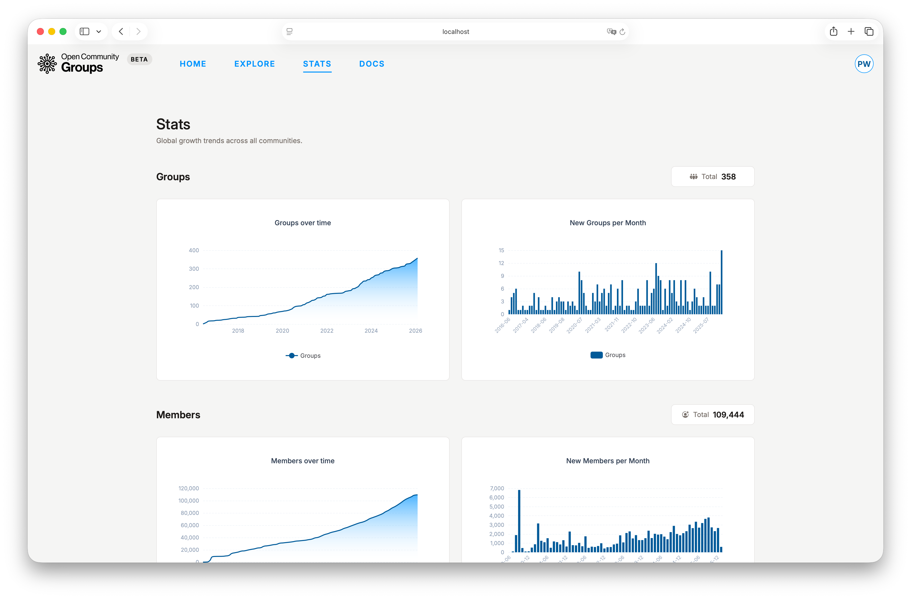

# Troubleshooting

This page helps you diagnose issues quickly by symptom.

## I Cannot Access a Dashboard

Check:

1. You are logged in.
2. You accepted the related invitation in
   [`User Dashboard -> Invitations`](/dashboard/user?tab=invitations ':ignore').
3. You selected the required context:
   - [Community dashboard](/dashboard/community ':ignore'): selected community.
   - [Group dashboard](/dashboard/group ':ignore'): selected community and group.

If actions still fail, re-select the community/group from dashboard selectors and refresh.

## Join Group or Attend Event Buttons Do Not Work

Check:

1. You are logged in.
2. The group/event is active and available.
3. You do not have stale session state (refresh page).

For events:

- Capacity limits can block new attendance.
- Canceled events disable normal participation.

## CFS Submit Button Is Disabled

Check:

1. CFS is enabled for the event.
2. CFS time window is currently open.
3. You are logged in.
4. You have at least one eligible session proposal.

In modal:

- Proposal options already submitted to the same event are disabled.

## I Cannot Resubmit or Withdraw a Submission

Submission actions depend on status:

- `Resubmit` is available for `Information requested`.
- `Withdraw` is available only while the submission is still active in review.
- After a final outcome (such as approved/linked), withdraw is no longer available.

Confirm current status in [`User Dashboard -> Submissions`](/dashboard/user?tab=submissions ':ignore').

## Event Cannot Be Published

Check event editor completeness:

1. Required details are filled (name, type, category, description).
2. Date/time is valid (end on/after start).
3. Meeting constraints are satisfied when automatic meeting is requested.
4. CFS rules are valid if CFS is enabled.

## Check-In Is Unavailable

Check:

1. You RSVP'd with this account.
2. Event is published and not canceled.
3. Check-in window is open:
   - Opens 2 hours before start.
   - Closes end of event day (or final day for multi-day events).

## Team Member Remove Action Is Disabled

For community/group team tables:

- You cannot remove the final accepted team member.

Add another accepted team member first, then retry.

## Analytics Looks Outdated

Analytics is cached and can lag by a few minutes.

Retry:

1. Refresh the page.
2. Wait briefly and refresh again.

## Email Send Is Disabled

For group members or event attendees:

- Send actions are disabled when recipient count is zero.

Also verify required fields:

- Title
- Body (plain text)

## Frequently Asked Questions

### Is OCG Mobile Friendly?

Public pages are usable on mobile. Dashboards are currently desktop-only.

### Where Do I Submit a Speaker Proposal?

Create proposals in
[`User Dashboard -> Session proposals`](/dashboard/user?tab=session-proposals ':ignore'), then submit from
each event's public CFS modal.

### Why Is My Proposal Missing in CFS Modal?

Likely causes:

- Proposal is not eligible for submission status.
- Proposal was already submitted to this event.
- You are logged in with a different account.

### Can I Undo a Submission?

You can withdraw while review is still active. After a final decision, withdraw is no longer
available.

### Can I Check In Without RSVP?

No. Only attendees can check in.

### Can I Use Automatic Meeting Creation on In-Person Events?

No. Automatic meeting requests are allowed only for `virtual` and `hybrid` events.

### Are Automatically Created Meetings Ended Automatically?

Yes. Meetings created automatically are also ended automatically when the
configured end time is reached.

### Why Are Host Controls Missing in Automatically Created Zoom Meetings?

At the moment, host controls are not available in automatically created Zoom
meetings due to some technical limitations.

### Where Can I See Platform-Wide Growth Trends?

Use the public [`Stats`](/stats ':ignore') page.

